<!-- _class: lead -->

# Scaffy

**AI that teaches you to build good code, not just builds for you.**

Fachhochschule · Frontend-UI · SoSe 2026

---

## Agenda

1. Der Scaffy Use Case
2. **Live-Demo**
3. Architektur (ABB / SSB)
4. Key Decisions
5. Besondere Projekt-Challenges
6. Qualität
7. Reflexion
8. Checkliste für Prüfungsleistung

---

## Hypothese: Desirable Friction _verringert_ Cognitive Debt beim Coding

> Erklärung _nach_ dem fertigen Code wird übersprungen —
> wie das bekannte HCI-Beispiel der vergessenen Bankkarte im Automaten, _wenn_ Geld zuerst ausgegeben würde.

**Scaffy:** erst Verständnisfrage, dann nächster Code-Chunk.

Details: [`Projektsteckbrief_Scaffy.md`](../Projektsteckbrief_Scaffy.md)

---

## Was tut Scaffy?

Der User gibt einen Prompt ein → KI liefert **geordnete Scaffolds** (Code + Knowledge Check pro Schritt).

- Code erscheint in einem **Code Editor**
- **Learning Cards** unterbrechen bewusst eine komplette Codegenerierung in einem Schritt im Editor.
- **Scaffy Tutor** KI Chatbot erklärt nebenan und kann bei der Beantwortung der Learning Card helfen — ersetzt die Lernfrage nicht

---

<!-- _class: live-demo -->

## Live Demo

<div class="live-demo-body">

<div class="live-demo-cta">
<p><strong>Jetzt Starten 👇</strong></p>
<p><a href="https://scaffy.vercel.app/">scaffy.vercel.app</a></p>
</div>

<div class="live-demo-meta">
Quellcode: <a href="https://github.com/alke0001/scaffy">github.com/alke0001/scaffy</a><br>
Kanban-Board: <a href="https://github.com/users/alke0001/projects/1">GitHub Projects</a>
</div>

</div>

---

## Logische Architektur (ABB)

<!-- sync: course-presentation/diagrams/abb-logical.mmd · docs/architecture.md §1 -->



Details: [`docs/architecture.md §1`](../docs/architecture.md#1-logical-architecture-abb)

---

## Physische Architektur (SSB)

<!-- sync: course-presentation/diagrams/ssb-physical.mmd · docs/architecture.md §2 -->



Details: [`docs/architecture.md §2`](../docs/architecture.md#2-physical-architecture-ssb)

---

## Key Decision 1: Frameworkwahl — SvelteKit

- SvelteKit 5 **SPA** — interaktive Session-UI, kein SSR für App-Shell
- Svelte 5 Runes, TypeScript, Vite
- Framework-Health-Check: Release-Kadenz, npm-Trends, Ökosystem
- Vollständiger Stack: [`§5 Technologies (meta)`](../docs/architecture.md#5-technologies-meta) in `architecture.md`

[`architecture.md §5`](../docs/architecture.md#5-technologies-meta) · [`svelte-health-check.md`](../docs/svelte-health-check.md) · [ADR-002](../docs/decisions.md#adr-002-spa-sveltekit-5-no-ssr-for-app-shell)

---

## Key Decision 2: Komponentenarchitektur

- **Routes** dünn (`+page.svelte`) → Feature-Views unter `src/lib/components/<area>/`
- **ui/** — shadcn-svelte zuerst; Custom wenn komponiert (ScaffyModal, ScrollArea) **oder** shadcn-Overhead zu groß für einfachen Einzelfall (z. B. `ScaffyDropdown` nur für Sprache)
- Server-only Code in `src/lib/server/` — nie im Client-Bundle

[`README § Repository structure`](../README.md#repository-structure) · [ADR-010](../docs/decisions.md#adr-010-repository-layout-and-typescript) · [ADR-016](../docs/decisions.md#adr-016-routes-feature-views-vs-ui-components) · [ADR-017](../docs/decisions.md#adr-017-ui-primitives-shadcn-first-scroll-area)

---

## Key Decision 3: State — drei Ebenen

<!-- sync: course-presentation/diagrams/state-flow.mmd · docs/architecture.md §6 -->


- **URL** — `/session/:id` · **Global** — `session.svelte.ts` + `localStorage` · **Lokal** — `$state` in Monaco/Chat
- Ask-Verlauf: Navigation ✅ · Full Reload ❌ (ADR-014)

[`architecture.md §6`](../docs/architecture.md#6-state-management) · [ADR-009](../docs/decisions.md#adr-009-session-store-for-scaffolds-monaco-later) · [ADR-007](../docs/decisions.md#adr-007-chatpanel-dual-mode-and-state-ownership) · [ADR-014](../docs/decisions.md#adr-014-learning-session-persistence-port--localstorage-first)

---

## Key Decision 4: Sicherer API-Zugriff

```
Browser  →  /api/*  (SvelteKit)  →  api.anthropic.com
```

- `ANTHROPIC_API_KEY` nur serverseitig (`$env/static/private`)
- **3 Endpoints:** scaffold (REST + JSON-Schema) · chat (SSE) · session-intro (SSE)

[`architecture.md §4`](../docs/architecture.md#4-http-api-flows) · [ADR-003](../docs/decisions.md#adr-003-claude-only-via-server-api-routes) · [ADR-004](../docs/decisions.md#adr-004-separate-api-endpoints-for-learn-and-ask) · [ADR-005](../docs/decisions.md#adr-005-learn-scaffold-rest--structured-json) · [ADR-006](../docs/decisions.md#adr-006-ask-chat-sse-streaming)

---

## Key Decision 5: Monaco (viewZones API)

- **`changeViewZones`** — `learning-card.svelte` scrollt mit Code (Svelte-Mount in Zone-DOM)
- Editor **read-only** bis Lektion fertig · Card Inhalt nicht kopierbar (Friction)
- **Trade-off:** Lighthouse `aria-hidden-focus` ~96 A11y — bewusst akzeptiert

[`architecture.md §5 Monaco APIs`](../docs/architecture.md#monaco-apis) · [ADR-011](../docs/decisions.md#adr-011-monaco-viewzones-editor-integration-and-a11y-trade-off)

---

## Besondere Projekt-Challenges

1. **Structured JSON / Validierung** — Lesson-JSON von Claude; `validate-lesson.ts` + Schema-Retry · Trade-off: Latenz vs. Zuverlässigkeit
2. **Performance Scaffold-API** — ein REST-Call für volle Lektion (10–30 s); paralleler Intro-SSE · Trade-off: kein Learn-Streaming (JSON-Integrität)

---

<!-- _class: compact -->

## Qualität

- **Tooling:** ESLint · Prettier · [Husky + lint-staged](../README.md#code-quality-and-git-hooks) · CI (`pnpm run ci`, lint, check, i18n)
- **Workflow:** Feature Branch → PR (Approval notwendig) → CI green → Merge ([README § CI](../README.md#continuous-integration))
- **Deploy:** [scaffy.vercel.app](https://scaffy.vercel.app/) — Vercel Serverless ([README § CD](../README.md#continuous-deployment))
- **Dokumentation:**
  - [README](../README.md)
  - [architecture.md](../docs/architecture.md) · [decisions.md](../docs/decisions.md) · [svelte-health-check.md](../docs/svelte-health-check.md)

**Lighthouse:**

| Route                         | Performance                    |
| ----------------------------- | ------------------------------ |
| `/`                           | 100                            |
| `/sessions`                   | 100                            |
| `/session/[id]` (Generierung) | ~83 (Monaco + parallele Loads) |

---

## Reflexion

**Was war unser Antrieb:**

- **Moderner Stack:**
  - **Svelte 5 & SvelteKit** — Web Development im state-of-the-art Stack hat richtig Spaß gemacht; fühlt sich sehr produktiv an
- **Sicherer API-Zugriff:** Server-seitige Claude-Anbindung über SvelteKit **API-Routes** — mit `$env/static/private` schnell und sauber umsetzbar
- **Anthropic API + SSE:** gut dokumentiert — **Learn** (REST/JSON) und **Tutor-Chat** (Stream) für zwei Use Cases zügig realisiert
- **Web-Technologien:** enorm mächtig — Markdown-Renderer im Chat, **Monaco** als Editor-Basis; vieles schon da, wenig neu erfinden
- **Dev Experience:** Zeit in Tooling, Hooks und Konventionen **zu Beginn** — am Ende effizienter im Team
  - **CI/CD:** GitHub Actions + Vercel — wichtig für uns als Team

---

## Reflexion — Was hat uns gebremst?

- **Technische Konzepte:** Vor parallel entwickeln **gemeinsam festlegen** — Routing, State, API-Grenzen; sonst späteres Nachziehen
- **Visual Design:** Beide keine Designer — viel Zeit für akzeptables Look & Feel (Farben, Fonts, Tokens); **kein fertiges Design System** out of the box für unser IDE Design gefunden.
- **Custom Components:** Eigenbau statt Katalog — z. B. **Learning Cards in Monaco**

---

## Reflexion — Agentic Coding

- Parallel in **Branches** schwerer — mehr Dateien, höheres **Merge-Konflikt**-Risiko
- KI generiert schnell, **Refactoring** hinkt hinterher — Technical Debt stapeln sich; dagegen hilft gezieltes Arbeiten mit **Rules & Skills** (Lernkurve — ein paar Gehversuche bei uns, weiter ausbaufähig)
- KI-Output nicht **blind mergen**! In Reviews Themen wie **KISS, DRY, YAGNI** einfordern.
- KI gezielt zum **Refactoren** nutzen — nicht nur Code stapeln lassen

---

## Checkliste für Prüfungsleistung

Vollständige Checkliste inkl. Add-ons und Scaffy-Stärken:

[`Projektsteckbrief_Scaffy.md § Checkliste`](../Projektsteckbrief_Scaffy.md#pflicht-checkliste)

---

<!-- _class: lead lead-close -->

# Fragen?

<div class="lead-close-grid">
	<span class="lead-close-label">Slides:</span>
	<span class="lead-close-value"><a href="scaffy-course.md">course-presentation/scaffy-course.md</a></span>
	<span class="lead-close-label">Doku:</span>
	<span class="lead-close-value"><a href="../docs/">docs/</a></span>
	<span class="lead-close-label">Checkliste + Steckbrief:</span>
	<span class="lead-close-value"><a href="../Projektsteckbrief_Scaffy.md">Projektsteckbrief_Scaffy.md</a></span>
	<span class="lead-close-label">Live Deploy:</span>
	<span class="lead-close-value"><a href="https://scaffy.vercel.app/">scaffy.vercel.app</a></span>
</div>
