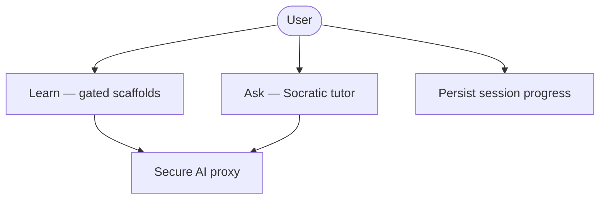
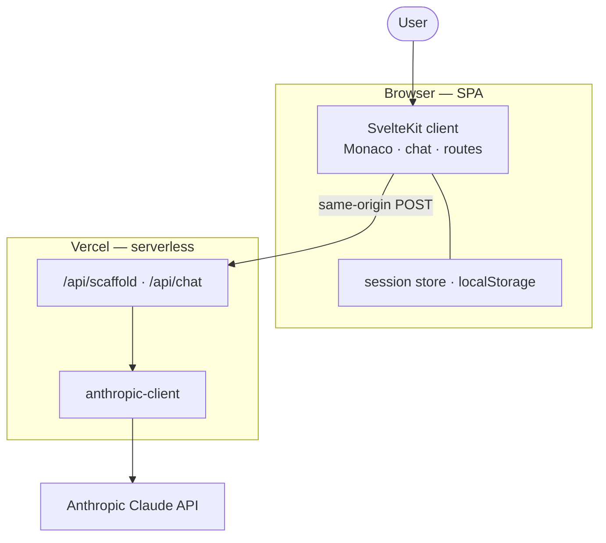
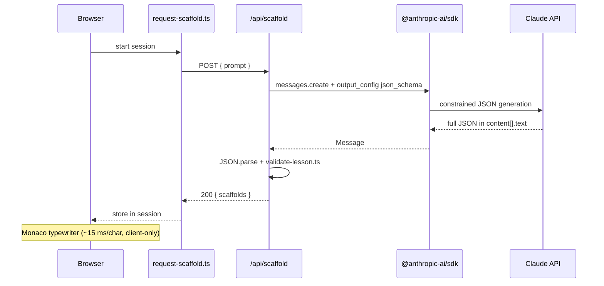
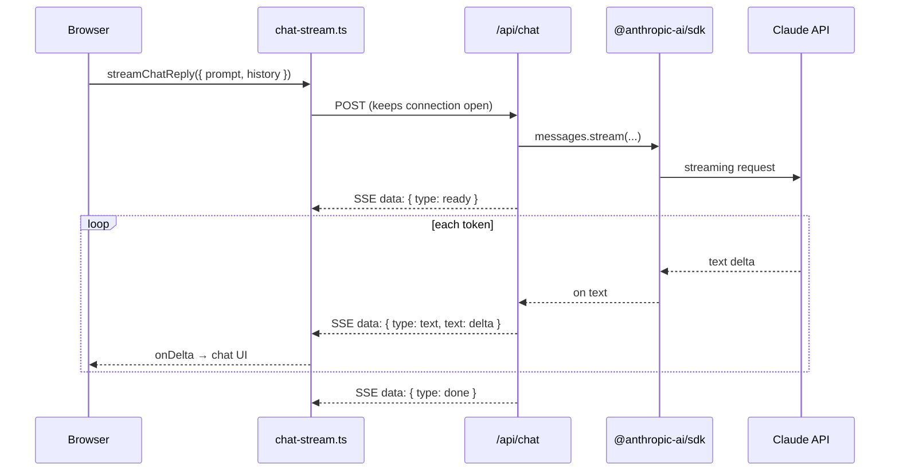
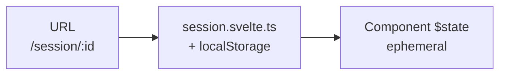

# Scaffy — Architecture

Three separate views — do not mix them:

| View             | Also called                               | Answers                                        |
| ---------------- | ----------------------------------------- | ---------------------------------------------- |
| **Logical**      | Macro · ABB (Architecture Building Block) | _What_ must the system do?                     |
| **Physical**     | Micro · SSB (Solution Building Block)     | _Where_ does it run, and how do parts connect? |
| **Technologies** | Meta                                      | _With what_ libraries, SDKs, and tooling?      |

SSBs **realize** ABBs. Technologies **implement** SSBs — they are not building blocks themselves.

---

## 1. Logical architecture (ABB)

Capabilities only — no frameworks, no deployment targets.

| ABB                 | Responsibility                                                            |
| ------------------- | ------------------------------------------------------------------------- |
| **Learn**           | Deliver ordered code steps; a knowledge gate blocks each next step        |
| **Ask**             | Side tutor that explains concepts without replacing the Learn gate        |
| **Persist**         | Learning progress and session list survive browser reload                 |
| **Secure AI proxy** | All model calls go through the server; credentials never reach the client |

---

## 2. Physical architecture (SSB)

Runtime topology — who talks to whom. One request path, top to bottom.

| SSB                              | Role                                                          |
| -------------------------------- | ------------------------------------------------------------- |
| **SvelteKit client**             | SPA shell, Learn UI (Monaco + Learning Cards), Ask chat panel |
| **session store · localStorage** | Client-side persistence for sessions and scaffold progress    |
| **`/api/scaffold`**              | Learn: REST, structured JSON, server-side schema validation   |
| **`/api/chat`**                  | Ask: SSE stream from server → browser                         |
| **anthropic-client**             | Shared server module; holds API key, model resolution         |
| **Claude API**                   | External model provider                                       |

---

## 3. Logical → physical mapping

| ABB                 | Realized by (SSB)                                                             |
| ------------------- | ----------------------------------------------------------------------------- |
| **Learn**           | SvelteKit client (Monaco viewZones) + `POST /api/scaffold`                    |
| **Ask**             | SvelteKit client (chat panel) + `POST /api/chat` (SSE)                        |
| **Persist**         | `session.svelte.ts` + `localStorage`                                          |
| **Secure AI proxy** | SvelteKit `+server.ts` on Vercel + `anthropic-client` + `$env/static/private` |

---

## 4. HTTP API flows (Learn vs Ask)

Both endpoints use **`@anthropic-ai/sdk`** on the server only. The browser never calls Anthropic directly.  
The two modes differ in **SDK method**, **Anthropic feature**, and **how the response reaches the browser**.

|                         | **Learn** `POST /api/scaffold`                                        | **Ask** `POST /api/chat`                                  |
| ----------------------- | --------------------------------------------------------------------- | --------------------------------------------------------- |
| **SDK call**            | `client.messages.create(...)`                                         | `client.messages.stream(...)`                             |
| **Anthropic feature**   | Structured output (`output_config.format: json_schema`)               | Text streaming (token deltas)                             |
| **Response to browser** | Single JSON body `{ scaffolds }`                                      | Many SSE chunks (`text/event-stream`)                     |
| **Client code**         | `src/lib/learn/request-scaffold.ts` — one `fetch`, wait for full JSON | `src/lib/api/chat-stream.ts` — `fetch` + manual SSE parse |
| **Perceived UX**        | Code typewriter in Monaco _after_ download (client-only)              | Chat text grows live while tokens arrive                  |

### Learn — structured output (REST, no stream)

Claude must return JSON matching a fixed schema (scaffolds + knowledge checks). The SDK enforces the shape; the server validates content and may retry once.

**Key files**

| Layer      | File                                         | Role                                          |
| ---------- | -------------------------------------------- | --------------------------------------------- |
| Client     | `src/lib/learn/request-scaffold.ts`          | `POST /api/scaffold`, stores scaffolds        |
| Server     | `src/routes/api/scaffold/+server.ts`         | Proxy, retry on validation failure            |
| Schema     | `src/lib/server/scaffold/output.schema.json` | Wire schema for `output_config.format.schema` |
| Validation | `src/lib/server/scaffold/validate-lesson.ts` | Count, cumulative code chain, option rules    |

### Ask — streaming (SDK on server, custom SSE to browser)

Two hops — do not conflate them:

1. **`@anthropic-ai/sdk`** streams Claude → Vercel (`messages.stream`, `on('text')`).
2. **Custom bridge** (no library): `ReadableStream` in `+server.ts` re-emits chunks as SSE; `chat-stream.ts` reads them with `fetch` + `getReader()` (not browser `EventSource`, because the route is `POST`).

**Key files**

| Layer  | File                                        | Role                                        |
| ------ | ------------------------------------------- | ------------------------------------------- |
| UI     | `src/lib/components/chat/chat-panel.svelte` | Calls `streamChatReply`                     |
| Client | `src/lib/api/chat-stream.ts`                | `fetch` POST, parse `data: …` lines         |
| Server | `src/routes/api/chat/+server.ts`            | SDK stream → `ReadableStream` → SSE headers |
| Shared | `src/lib/server/anthropic-client.ts`        | `new Anthropic({ apiKey })`                 |

---

## 5. Technologies (meta)

Cross-cutting choices that cut across physical components. Listed here, not in the diagrams above.

| Area          | Technology                                                 | Used for                                            |
| ------------- | ---------------------------------------------------------- | --------------------------------------------------- |
| **Framework** | SvelteKit 5 (SPA), Svelte 5 runes, TypeScript, Vite        | App shell, routing, components, build               |
| **Bundling**  | Conditional dynamic `import()` on `/sessions`              | Empty state eager; list UI lazy when sessions exist |
| **UI**        | Tailwind CSS 4, shadcn-svelte (bits-ui), Lucide icons      | Layout, design system, icons                        |
| **Layout**    | paneforge                                                  | Resizable editor / chat split                       |
| **Editor**    | Monaco Editor (`@monaco-editor/loader`)                    | Code display, viewZones for Learning Cards          |
| **AI SDK**    | `@anthropic-ai/sdk`                                        | All server-side Claude calls (see §4)               |
| **Markdown**  | `marked` + `dompurify`                                     | Ask replies and About dialog                        |
| **State**     | Singleton `.svelte.ts` stores, URL routing, `localStorage` | See [§6 State management](#6-state-management)      |
| **Deploy**    | `@sveltejs/adapter-vercel`, Vercel serverless              | Production hosting, API routes                      |
| **Quality**   | Prettier, ESLint, Husky, lint-staged, GitHub Actions       | Format, lint, pre-commit, CI                        |

**Models:** `claude-sonnet-4-5`, `claude-sonnet-4-6` (see `anthropic-client.ts`, `ANTHROPIC_DEFAULT_MODEL`).

**Routes note:** `/history` is a legacy alias — it 308-redirects to `/sessions` (`src/routes/history/+page.ts`, ADR-015).

---

## 6. State management

Three layers — separate from ABB/SSB (§1–2) and API transport (§4).

| Layer      | Where                       | Persists on reload?      | Holds                                                                                     |
| ---------- | --------------------------- | ------------------------ | ----------------------------------------------------------------------------------------- |
| **URL**    | SvelteKit routes            | —                        | Which session/workspace is open (`/session/:id`)                                          |
| **Global** | `src/lib/session.svelte.ts` | **Yes** → `localStorage` | Session list, prompt, scaffold JSON from Claude, API status, `completed` flag, active tab |
| **Local**  | Component `$state`          | **No**                   | In-lesson step index, Learning Card UI, typewriter animation, Ask chat messages           |

### Global store (`session.svelte.ts`)

Single app-wide singleton. Source of truth for **Learn data**.

| In memory                                      | Also in `localStorage`     |
| ---------------------------------------------- | -------------------------- |
| `sessions[]` — all `SessionRecord` entries     | `scaffy.sessions`          |
| `activeSessionId`                              | `scaffy.activeSessionId`   |
| `status`, `errorMessage` — active session only | (restored from active row) |

**Per session:** `id`, `prompt`, `createdAt`, `scaffolds[]`, `status`, `errorMessage`, `completed`.

**Lifecycle:** `idle` → `loading` (`startScaffoldRequest`) → `ready` (`setScaffolds`) or `error` → retry → `loading`. `completed` via `markSessionCompleted()` after all gates passed.

### Ephemeral (not in store)

| Location                          | State                                                         | Lost on reload?                     |
| --------------------------------- | ------------------------------------------------------------- | ----------------------------------- |
| `monaco-editor.svelte`            | `currentIndex`, Learning Card UI, editor/typewriter animation | Yes — lesson restarts at scaffold 0 |
| `knowledge-zone-bridge.svelte.ts` | Monaco viewZone ↔ Learning Card bridge (per editor instance)  | Yes                                 |
| `chat-panel.svelte`               | Ask `messages[]`, streaming status, prompt draft              | Yes                                 |

Scaffold payloads from Claude stay in `localStorage`; they are not re-fetched on reload. Ask chat history is out of scope (ADR-014). In-lesson step index is not yet persisted (ADR-014).

**Code:** file header and section comments in `src/lib/session.svelte.ts`.

---

## Further reading

- **Why these choices:** [`docs/decisions.md`](decisions.md) (ADRs)
- **Agent invariants:** [`CLAUDE.md`](../CLAUDE.md)
