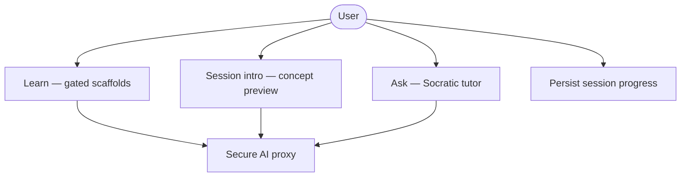
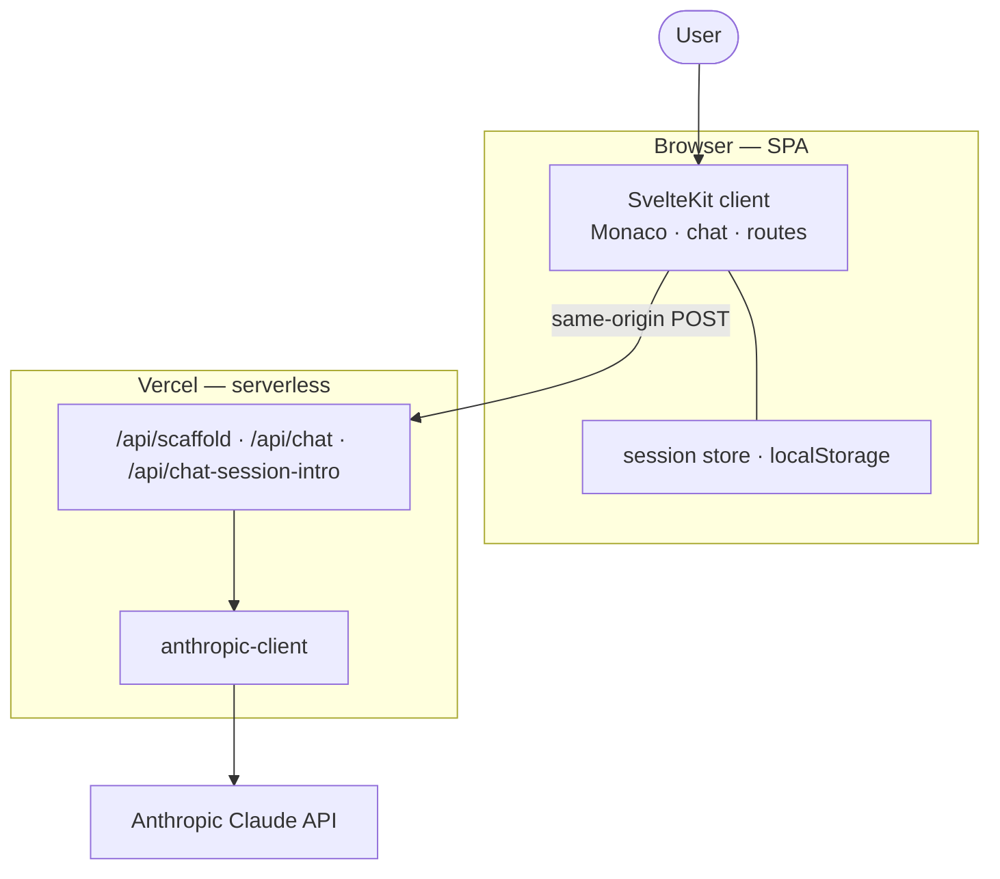
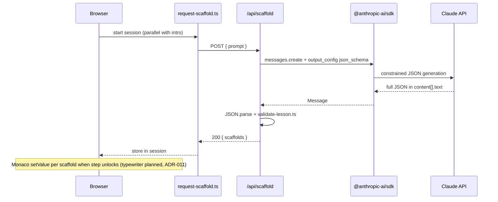
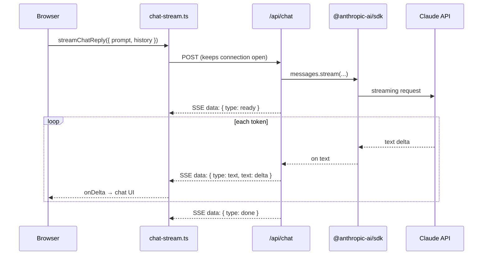
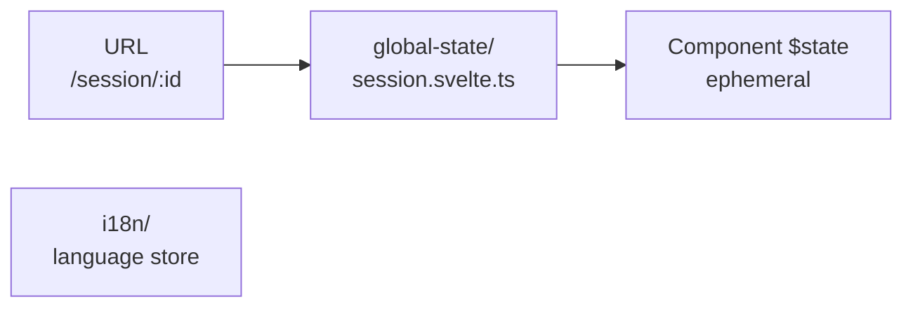

# Scaffy — Architecture

Three separate views — do not mix them:

| View             | Also called                               | Answers                                        |
| ---------------- | ----------------------------------------- | ---------------------------------------------- |
| **Logical**      | Macro · ABB (Architecture Building Block) | _What_ must the system do?                     |
| **Physical**     | Micro · SSB (Solution Building Block)     | _Where_ does it run, and how do parts connect? |
| **Technologies** | Meta                                      | _With what_ libraries, SDKs, and tooling?      |

SSBs **realize** ABBs. Technologies **implement** SSBs — they are not building blocks themselves.

---

## 1. Logical architecture (ABB)

Capabilities only — no frameworks, no deployment targets.

| ABB                 | Responsibility                                                            |
| ------------------- | ------------------------------------------------------------------------- |
| **Learn**           | Deliver ordered code steps; a knowledge gate blocks each next step        |
| **Session intro**   | Stream a concept preview in Ask while the lesson generates                |
| **Ask**             | Side tutor that explains concepts without replacing the Learn gate        |
| **Persist**         | Learning progress and session list survive browser reload                 |
| **Secure AI proxy** | All model calls go through the server; credentials never reach the client |

---

## 2. Physical architecture (SSB)

Runtime topology — who talks to whom. One request path, top to bottom.

| SSB                              | Role                                                                       |
| -------------------------------- | -------------------------------------------------------------------------- |
| **SvelteKit client**             | SPA shell, Learn UI (Monaco + Learning Cards), Ask chat panel              |
| **session store · localStorage** | Client-side persistence for sessions and scaffold progress                 |
| `/api/scaffold`                  | Learn: REST, structured JSON, server-side schema validation                |
| `/api/chat-session-intro`        | Session intro: Server-Sent Events (SSE) concept preview while lesson loads |
| `/api/chat`                      | Ask: Server-Sent Events (SSE) stream from server → browser                 |
| **anthropic-client**             | Shared server module; holds API key, model resolution                      |
| **Claude API**                   | External model provider                                                    |

---

## 3. Logical → physical mapping

| ABB                 | Realized by (SSB)                                                                             |
| ------------------- | --------------------------------------------------------------------------------------------- |
| **Learn**           | SvelteKit client (Monaco viewZones + `setValue`) + `POST /api/scaffold`                       |
| **Session intro**   | SvelteKit client (Ask panel intro slot) + `POST /api/chat-session-intro` (Server-Sent Events) |
| **Ask**             | SvelteKit client (chat panel) + `POST /api/chat` (Server-Sent Events)                         |
| **Persist**         | `src/lib/global-state/session.svelte.ts` + `localStorage`                                     |
| **Secure AI proxy** | SvelteKit `+server.ts` on Vercel + `anthropic-client` + `$env/static/private`                 |

---

## 4. HTTP API flows

Three `POST /api/*` surfaces — each with its own `system-prompt.md` under `src/lib/server/<endpoint>/`. The browser never calls Anthropic directly; all use `@anthropic-ai/sdk` on the server.

> **Server-Sent Events (SSE)** — one HTTP response stays open; the server pushes many `data: …` lines as text arrives (`Content-Type: text/event-stream`). Used for Ask chat and session intro. Scaffy parses them with `fetch` **POST** + `getReader()` (not the browser’s `EventSource`, which only supports GET).

| Surface             | Route                          | Transport                       | Output / Anthropic feature      | Client module                           |
| ------------------- | ------------------------------ | ------------------------------- | ------------------------------- | --------------------------------------- |
| **Learn scaffolds** | `POST /api/scaffold`           | **REST** (single JSON response) | Structured JSON (`json_schema`) | `request-scaffold.ts`                   |
| **Ask tutor**       | `POST /api/chat`               | **Server-Sent Events (SSE)**    | Plain text stream               | `chat-stream.ts` → `streamChatReply`    |
| **Session intro**   | `POST /api/chat-session-intro` | **Server-Sent Events (SSE)**    | Plain text concept preview      | `chat-stream.ts` → `streamSessionIntro` |

On `/session/[id]` load, **scaffold REST** and **session intro (SSE)** run **in parallel** (`ensureScaffold` + `ensureSessionIntro`). Intro failure does not block the lesson.

### Learn — structured output (REST)

Claude must return JSON matching a fixed schema (scaffolds + knowledge checks). The SDK enforces the shape; the server validates content and may retry once.

**Key files**

| Layer      | File                                         | Role                                          |
| ---------- | -------------------------------------------- | --------------------------------------------- |
| Client     | `src/lib/scaffold/request-scaffold.ts`       | `POST /api/scaffold`, stores scaffolds        |
| Server     | `src/routes/api/scaffold/+server.ts`         | Proxy, retry on validation failure            |
| Prompt     | `src/lib/server/scaffold/system-prompt.md`   | Learn pedagogy for structured output          |
| Schema     | `src/lib/server/scaffold/output.schema.json` | Wire schema for `output_config.format.schema` |
| Validation | `src/lib/server/scaffold/validate-lesson.ts` | Count, cumulative code chain, option rules    |

### Session intro — streaming (Server-Sent Events)

One-shot concept preview in the Ask panel while scaffolds generate. Same Server-Sent Events bridge as Ask (`chat-stream.ts`).

| Layer  | File                                                 | Role                                     |
| ------ | ---------------------------------------------------- | ---------------------------------------- |
| Client | `src/lib/chat/request-session-intro.ts`              | Intro slot, batched store updates        |
| Client | `src/lib/api/chat-stream.ts`                         | Shared Server-Sent Events parser         |
| Server | `src/routes/api/chat-session-intro/+server.ts`       | SDK stream → Server-Sent Events response |
| Prompt | `src/lib/server/chat/session-intro-system-prompt.md` | Concept preview (no solution code)       |

**Gate:** Monaco waits for **Got it — start lesson** (`lessonStarted`) before first scaffold — ADR-021.

### Ask — streaming (Server-Sent Events)

Two hops — do not conflate them:

1. `@anthropic-ai/sdk` streams Claude → Vercel (`messages.stream`, `on('text')`).
2. **Custom bridge** (no library): `ReadableStream` in `+server.ts` re-emits chunks as **Server-Sent Events**; `chat-stream.ts` reads them with `fetch` + `getReader()` (not browser `EventSource`, because the route is `POST`).

**Key files**

| Layer  | File                                        | Role                                                       |
| ------ | ------------------------------------------- | ---------------------------------------------------------- |
| UI     | `src/lib/components/chat/chat-panel.svelte` | Calls `streamChatReply`                                    |
| Client | `src/lib/api/chat-stream.ts`                | `fetch` POST, parse `data: …` lines                        |
| Server | `src/routes/api/chat/+server.ts`            | SDK stream → `ReadableStream` → Server-Sent Events headers |
| Prompt | `src/lib/server/chat/ask-system-prompt.md`  | Socratic Ask tutor                                         |
| Shared | `src/lib/server/anthropic-client.ts`        | `new Anthropic({ apiKey })`                                |

---

## 5. Technologies (meta)

Cross-cutting choices that cut across physical components. Listed here, not in the diagrams above.

| Area                | Technology                                                           | Used for                                                                                                             |
| ------------------- | -------------------------------------------------------------------- | -------------------------------------------------------------------------------------------------------------------- |
| **Framework**       | SvelteKit 5 (SPA), Svelte 5 runes, TypeScript, Vite                  | App shell, routing, components, build                                                                                |
| **Bundling**        | Conditional dynamic `import()` on `/sessions`                        | Empty state eager; list UI lazy when sessions exist                                                                  |
| **UI**              | Tailwind CSS 4, shadcn-svelte (bits-ui), Lucide icons                | Layout, design system, icons                                                                                         |
| **Layout**          | paneforge                                                            | Resizable editor / chat split                                                                                        |
| **Editor**          | Monaco Editor (`monaco-editor`, **MIT**) via `@monaco-editor/loader` | Code display, viewZones (Learning Card, loading spinner); license audit — ADR-024                                    |
| **AI SDK**          | `@anthropic-ai/sdk`                                                  | All server-side Claude calls (see §4)                                                                                |
| **Markdown**        | `marked` + `dompurify`                                               | Ask replies and About dialog                                                                                         |
| **State**           | Singleton `.svelte.ts` stores, URL routing, `localStorage`           | See [§6 State management](#6-state-management)                                                                       |
| **Deploy**          | `@sveltejs/adapter-vercel`, Vercel serverless                        | Production hosting, API routes                                                                                       |
| **Quality**         | Prettier, ESLint, Husky, lint-staged, **Vitest**, GitHub Actions     | Format, lint, unit testing, pre-commit, CI                                                                           |
| **Package manager** | [pnpm](https://pnpm.io) (not npm)                                    | Install, scripts, CI (`pnpm run ci` with frozen lockfile); faster deduped `node_modules`, stricter dependency layout |

CI and local dev assume `pnpm-lock.yaml` — use `pnpm install`, not `npm install`.

### Testing

The project uses **Vitest** for unit testing. Quality gates (`pnpm run verify`, CI, Husky lint-staged) are documented in [ADR-010](decisions.md#adr-010-repository-layout-typescript-and-quality-gates) and the [README](../README.md#quality-gates).

**Local PR check:** `pnpm run verify` (lint, check, check:i18n, test:run). **CI (Option B):** same checks plus **`licenses:ci`** (full production scan → `sbom.json` → allowlist — ADR-024; artifact `production-sbom`). **Local SBOM:** `pnpm run sbom` then `pnpm run licenses:check`. **Pre-commit:** Vitest runs only when staged files touch `src/routes/api/**` (`vitest related --run`) or `src/lib/server/**` (full suite).

The following components are covered by unit tests:

- `src/routes/api/chat/+server.ts`
- `src/routes/api/scaffold/+server.ts`
- `src/routes/api/chat-session-intro/+server.ts`
- `src/routes/api/chat/utils.ts`

The API route tests verify request validation, response handling, and interactions with the Anthropic client. The utility tests verify the helper functions independently.

External Anthropic API calls are mocked during testing. This allows the tests to run deterministically without requiring network access or consuming API credits.

### Monaco APIs

| API                        | Purpose                                                                                                       |
| -------------------------- | ------------------------------------------------------------------------------------------------------------- |
| `editor.create`            | Standalone Learn editor (`monaco-editor.svelte`)                                                              |
| `setValue`                 | Scaffold snippets (full chunk); loading/wait `<!-- HTML comments -->`; errors; clear buffer                   |
| `changeViewZones`          | **Custom DOM in editor flow** — Learning Card (Svelte); loading spinner (plain DOM). No per-frame model edits |
| `deltaDecorations`         | Inline styling on scaffold error screen                                                                       |
| `setModelLanguage`         | `html` for scaffolds and loading states                                                                       |
| `updateOptions`            | `readOnly` (locked until lesson complete); loading cursor                                                     |
| `onDidAttemptReadOnlyEdit` | Read-only edit hint overlay                                                                                   |

**Code:** `monaco-editor.svelte`, `monaco-knowledge-view-zone.ts`, `monaco-scaffold-loading.ts`.

**Models:** `claude-sonnet-4-5`, `claude-sonnet-4-6` (see `anthropic-client.ts`, `ANTHROPIC_DEFAULT_MODEL`).

**Routes note:** `/history` is a legacy alias — it 308-redirects to `/sessions` (`src/routes/history/+page.ts`, ADR-015).

---

## 6. State management

Three layers — separate from ABB/SSB (§1–2) and API transport (§4).

**Global rune singletons** live in **`src/lib/global-state/`** (`.svelte.ts` modules). **i18n** stays in **`src/lib/i18n/`** (Svelte store module + `translations.ts`). Each persisting module documents `localStorage` in its file header.

| Layer      | Where                            | Persists on reload?         | Holds                                                                         |
| ---------- | -------------------------------- | --------------------------- | ----------------------------------------------------------------------------- |
| **URL**    | SvelteKit routes                 | —                           | Which session/workspace is open (`/session/:id`)                              |
| **Global** | `global-state/session.svelte.ts` | **Partial** → see module    | Learn sessions, scaffolds, API status, active tab                             |
| **Global** | `i18n/` (`language` store)       | **Yes** → `scaffy.language` | UI locale only — not lesson progress (ADR-020)                                |
| **Local**  | Component `$state`               | **No**                      | In-lesson step index, Learning Card UI, loading spinner rAF, Ask prompt draft |

### `global-state/session.svelte.ts`

Single app-wide singleton. Source of truth for **Learn data**. **Persists** via `persistSessions()` → `scaffy.sessions`, `scaffy.activeSessionId`.

| In memory                                      | Also in `localStorage`            |
| ---------------------------------------------- | --------------------------------- |
| `sessions[]` — all `SessionRecord` entries     | `scaffy.sessions`                 |
| `activeSessionId`                              | `scaffy.activeSessionId`          |
| `status`, `errorMessage` — active session only | (restored from active row)        |
| `askMessages[]` per session — Ask chat thread  | in-memory only (stripped on save) |

**Per session:** `id`, `prompt`, `createdAt`, `scaffolds[]`, `status`, `errorMessage`, `completed`, `askMessages[]`, `introStatus`, `lessonStarted` (last two in-memory only).

**Lifecycle:** `idle` → `loading` (`startScaffoldRequest` + parallel intro) → `ready` (`setScaffolds`) or `error` → retry → `loading`. `lessonStarted` gates first scaffold in Monaco (ADR-021). `completed` via `markSessionCompleted()` after all gates passed.

### Ephemeral (not in store)

| Location                          | State                                                        | Lost on reload?                     |
| --------------------------------- | ------------------------------------------------------------ | ----------------------------------- |
| `knowledge-zone-bridge.svelte.ts` | Monaco viewZone ↔ Learning Card bridge (per editor instance) | Yes                                 |
| `monaco-scaffold-loading.ts`      | Loading spinner viewZone (plain DOM, rAF)                    | Yes                                 |
| `monaco-editor.svelte`            | `currentIndex`, Learning Card UI, step reveal                | Yes — lesson restarts at scaffold 0 |

**Ask chat:** `askMessages` on `SessionRecord` — survives SPA navigation (Home ↔ Session ↔ Sessions); **not** in `localStorage` (lost on full reload). In-lesson step index is not yet persisted (ADR-014).

**Code:** file headers in `src/lib/global-state/session.svelte.ts` and `src/lib/i18n/index.ts`.

---

## Further reading

- **Why these choices:** [`docs/decisions.md`](decisions.md) (ADRs)
- **Agent invariants:** [`CLAUDE.md`](../CLAUDE.md)
