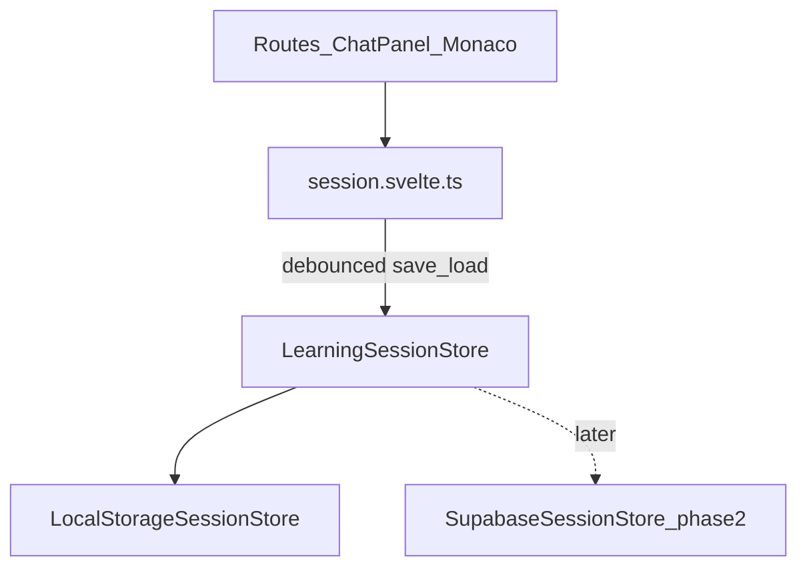

# Scaffy — Architecture & Design Decisions

This document records **why** Scaffy is built the way it is. It complements [`CLAUDE.md`](../CLAUDE.md), which holds short, agent-facing invariants synced to Cursor and GitHub Copilot.

| Audience  | Use                                                                                                         |
| --------- | ----------------------------------------------------------------------------------------------------------- |
| Humans    | Full context, alternatives, and status                                                                      |
| AI agents | Read relevant sections when changing chat, API, or state; keep `CLAUDE.md` in sync only for top-level rules |

**How to maintain:** When a decision changes, update the entry here (status, consequences). If agents must always obey it, add or adjust a short bullet in `CLAUDE.md` and sync `.cursor/rules/design-decisions.mdc` + `.github/copilot-instructions.md` in the same edit batch.

---

## Index

ADR = Architecture Decision Record

| ID                                                                        | Title                                                  | Status                             |
| ------------------------------------------------------------------------- | ------------------------------------------------------ | ---------------------------------- |
| [ADR-001](#adr-001-product-vision-scaffolding--friction)                  | Product vision: scaffolding + friction                 | Accepted                           |
| [ADR-002](#adr-002-spa-sveltekit-5-no-ssr-for-app-shell)                  | SPA: SvelteKit 5, no SSR for app shell                 | Accepted                           |
| [ADR-003](#adr-003-claude-only-via-server-api-routes)                     | Claude only via server API routes                      | Accepted                           |
| [ADR-004](#adr-004-separate-api-endpoints-for-learn-and-ask)              | Separate API endpoints for Learn and Ask               | Accepted                           |
| [ADR-005](#adr-005-learn-scaffold-rest--structured-json)                  | Learn: REST + structured JSON                          | Accepted                           |
| [ADR-006](#adr-006-ask-chat-sse-streaming)                                | Ask: chat SSE streaming                                | Accepted                           |
| [ADR-007](#adr-007-chatpanel-dual-mode-and-state-ownership)               | ChatPanel dual mode and state ownership                | Accepted                           |
| [ADR-008](#adr-008-chat-message-lifecycle-statuses)                       | Chat message lifecycle statuses                        | Accepted                           |
| [ADR-009](#adr-009-session-store-for-scaffolds-monaco-later)              | Session store for scaffolds (Monaco later)             | Accepted                           |
| [ADR-010](#adr-010-repository-layout-and-typescript)                      | Repository layout and TypeScript                       | Accepted                           |
| [ADR-011](#adr-011-monaco-typewriter-and-viewzones-planned)               | Monaco typewriter and viewZones (planned)              | Accepted (not implemented)         |
| [ADR-012](#adr-012-ask-markdown-rendering-during-stream)                  | Ask markdown rendering during stream                   | Accepted                           |
| [ADR-013](#adr-013-documentation-split-claudemd-vs-decisionsmd)           | Documentation split: CLAUDE.md vs decisions.md         | Accepted                           |
| [ADR-014](#adr-014-learning-session-persistence-port--localstorage-first) | Learning session persistence port — localStorage first | Accepted (adapter not implemented) |

---

## ADR-001: Product vision — scaffolding + friction

**Status:** Accepted

### Context

Generic AI coding tools optimize for speed and full-file output. Scaffy targets **learning**: users should understand what they ship.

### Decision

- **Scaffolding:** Code is delivered in ordered steps (`scaffolds`), not one opaque blob.
- **Friction:** A knowledge check gates the next step until the user answers correctly (or acknowledges an explainer).
- **Punchline:** _"AI that teaches you to build good code, not just builds for you."_

### Consequences

- API and UI must support step index, questions, and progress (partially built; see ADR-009, ADR-011).
- Ask mode is a separate, low-friction tutor path (ADR-004), not a replacement for Learn.

---

## ADR-002: SPA — SvelteKit 5, no SSR for app shell

**Status:** Accepted

### Context

The session UI is highly interactive (Monaco, chat, resizable panes). SEO for the learning shell is not a priority.

### Decision

- SvelteKit 5 in **SPA mode** (no SSR/SSG for app pages).
- **Exception:** `src/routes/api/**` server routes run on the server for Claude proxying.
- Do not add `+page.server.ts` load functions for app routes outside `/api/`.

### Alternatives considered

- SSR for first paint — rejected; added complexity without clear benefit for v1.

### Consequences

- All learning UI state is client-side or via `fetch` to `/api/...`.
- Deployment fits Vercel adapter patterns already in the repo.

---

## ADR-003: Claude only via server API routes

**Status:** Accepted

### Context

`ANTHROPIC_API_KEY` in the browser bundle or network tab would expose the key to anyone.

### Decision

```
Browser → POST /api/<endpoint> (SvelteKit) → api.anthropic.com
```

- Key via `import { ANTHROPIC_API_KEY } from '$env/static/private'`.
- `.env.local` for local dev; `.env.example` committed as template.
- Client never calls `api.anthropic.com`.

### Consequences

- Every new Claude capability gets its own thin `+server.ts` (or shared server helper), not client SDK usage.

---

## ADR-004: Separate API endpoints for Learn and Ask

**Status:** Accepted

### Context

Learn and Ask need different system prompts, output shapes, temperatures, and transport.

### Decision

| Mode           | Route                | Transport | Output                                 |
| -------------- | -------------------- | --------- | -------------------------------------- |
| **Learn Code** | `POST /api/scaffold` | REST      | Structured JSON `{ scaffolds: [...] }` |
| **Ask**        | `POST /api/chat`     | SSE       | Plain text stream                      |

- Server assets: `src/lib/server/scaffold/` vs `src/lib/server/chat/`.
- Shared: `src/lib/server/anthropic-client.ts` (`@anthropic-ai/sdk`).

### Alternatives considered

- Single `/api/claude` with a `mode` flag — rejected; mixes unrelated config and is harder to test and tune.

### Consequences

- Two handlers to maintain; each can evolve independently (caching TTL, token limits, prompts).

---

## ADR-005: Learn — scaffold REST + structured JSON

**Status:** Accepted

### Context

Scaffy needs a fixed shape: `codeSnippet` + `knowledgeCheck` per step, validated server-side.

### Decision

- `client.messages.create` with `output_config.format.type: 'json_schema'` and schema from `output.schema.json` / `output-schema.ts`.
- **No API streaming** for scaffold: partial JSON is not reliably parseable.
- **Temperature ~0.3**, high `max_tokens` (8192) — tuned in `src/routes/api/scaffold/+server.ts`.
- Post-parse validation in `validateStructuredOutput()` (1–5 scaffolds, option ids, etc.).
- **Prompt rules:** min 10 characters; heuristic reject `<`, `{`, `;` to discourage pasting code snippets into Learn prompts.

### Consequences

- Perceived “streaming” for code is **client-side** only: Monaco typewriter (~15 ms/char) after the full response arrives (ADR-011).
- Learn chat UI does not show the raw JSON; scaffolds go to the session store (ADR-009).

---

## ADR-006: Ask — chat SSE streaming

**Status:** Accepted

### Context

Ask is free-form Q&A; users expect token-by-token replies like other chat products.

### Decision

- `client.messages.stream()` in `src/routes/api/chat/+server.ts`.
- Proxy emits **SSE** (`text/event-stream`): events `ready`, `text` (delta), `done`, `error`.
- **Temperature 0.55**, **`max_tokens` 2048** (teaching replies; ladder: UI concept → Runes → syntax).
- **History cap:** last **30 messages** (~15 user/assistant turns) in `buildMessages()` — cost and context control; focused use per open question, not long threads.
- **No** structured output schema; **scaffolded Socratic** tutor prompt in `src/lib/server/chat/system-prompt.md` (teach mental model first, then questions + small steps; not interrogation-only; topic-agnostic for any scaffold lesson; no MC spoilers).
- **Prompt rules:** min 10 characters; **no** `<`/`{`/`;` heuristic (code questions allowed).
- **Lesson context** (current scaffold/knowledge check) — planned later; not in API body yet.
- Client: `src/lib/api/chat-stream.ts` appends deltas; `request.signal` / `AbortController` for cancel.

### Alternatives considered

- **Vercel AI SDK** — rejected for v1; extra dependency, React-centric; `@anthropic-ai/sdk` already present.
- REST `json({ reply })` — rejected; worse UX for long answers.

### Consequences

- ChatPanel must handle `loading` → `streaming` → `complete` (ADR-008).
- Assistant replies rendered as Markdown in Ask mode (ADR-012).

---

## ADR-007: ChatPanel dual mode and state ownership

**Status:** Accepted

### Context

The session view needs a prompt/response loop beside Monaco without tight coupling.

### Decision

- **`ChatPanel.svelte`** owns **local** chat UI state: `learnMessages`, `askMessages`, mode toggle (`learn` | `ask`), prompt input.
- **Learn** calls `/api/scaffold`; on success writes scaffolds via **`session.svelte.ts`**, not into chat bubbles.
- **Ask** calls `/api/chat` stream; assistant text stays in `askMessages`.
- **Separate histories** per mode when switching toggle.
- **Learn success UX:** user message + loading placeholder; on success **remove** assistant placeholder (no success assistant bubble).
- **Learn error UX:** assistant placeholder becomes `error` with message.
- Communication with Monaco is **only** through the session store (and future `editor` / `questions` stores), not props between panes.

### Consequences

- `+page.svelte` only lays out Monaco + `ChatPanel`; no shared props between them yet.
- Replacing the old API smoke-test panel (`claude-chat-panel.svelte`) was intentional.

---

## ADR-008: Chat message lifecycle statuses

**Status:** Accepted

### Context

Chat UIs need visible pending/loading/streaming/error states; the same model should extend to retries/cancel later.

### Decision

Types in `src/lib/types/chat-message.ts`:

| Status      | Meaning                                |
| ----------- | -------------------------------------- |
| `pending`   | Optimistic / sending (optional, short) |
| `loading`   | Request started, no content yet        |
| `streaming` | Ask: tokens arriving                   |
| `complete`  | Success, settled                       |
| `error`     | Failed; optional partial `content`     |

- `isThreadBusy()` disables send while any message is `pending` | `loading` | `streaming`.
- Ask history for the API: only `complete` user/assistant messages (`toChatHistory()`).
- UI: `chat-message.svelte` + `chat-message-list.svelte` (auto-scroll, `aria-live="polite"`).

### Consequences

- New features (retry, cancelled) should extend `ChatMessageStatus`, not ad-hoc booleans.

---

## ADR-009: Session store for scaffolds (Monaco later)

**Status:** Accepted (partial implementation)

### Context

Learn responses are not chat content; Monaco and question UI need a shared scaffold list.

### Decision

- `src/lib/session.svelte.ts`: `status` (`idle` | `loading` | `ready` | `error`), `scaffolds`, `errorMessage`.
- `startScaffoldRequest()` clears scaffolds and sets `loading`.
- Client-safe types in `src/lib/types/scaffold.ts`; server `output-schema.ts` imports them.

### Not yet implemented (planned)

- `editor.svelte.ts`, `questions.svelte.ts`, step index, localStorage progress, `/session/:id` routes.

### Consequences

- Do not import `$lib/server/*` from client components; share types via `$lib/types/`.

---

## ADR-010: Repository layout and TypeScript

**Status:** Accepted

### Context

The codebase will grow (Monaco, questions, more API surfaces). Conventions reduce navigation cost.

### Decision

- **UI:** `src/lib/components/<area>/` (`chat`, `editor`, …); promote to `src/lib/features/<name>` if an area grows large.
- **API routes:** `src/routes/api/<endpoint>/+server.ts` — one folder per HTTP surface.
- **Server-only:** `src/lib/server/<endpoint>/` + shared `anthropic-client.ts`.
- **All application code:** TypeScript; Svelte `<script lang="ts">`; no new `.js` under `src/`.
- **README / code comments:** American English; chat with users may be German.

### Models (implementation note)

Code uses logical IDs `claude-sonnet-4-5` | `claude-sonnet-4-6` mapped in `anthropic-client.ts`. Older docs mentioning `claude-sonnet-4-20250514` are stale relative to the repo.

---

## ADR-011: Monaco typewriter and viewZones (planned)

**Status:** Accepted — **not implemented**

### Context

Learn mode should feel like live typing without API streaming of JSON.

### Decision (target)

- Integrate `monaco-editor` in place of the placeholder.
- Reveal each `codeSnippet` with `editor.executeEdits()` ~15 ms per character.
- Show `knowledgeCheck` in a **viewZone** (or overlay widget) between code lines.
- Unlock next scaffold only after a correct answer ( `questions` store).

### Current state

- `monaco-editor-placeholder.svelte` only; package not wired in the learning loop.

---

## ADR-012: Ask markdown rendering during stream

**Status:** Accepted

### Context

Claude Ask replies are often Markdown (`**bold**`, fenced code). Plain `whitespace-pre-wrap` showed raw syntax.

### Decision

- **Scope:** Assistant messages in **Ask** mode only (`chat-message.svelte` → `ChatMarkdown.svelte`). User bubbles, Learn mode, and errors stay plain text.
- **Libraries:** `marked` (GFM) + `dompurify` in `src/lib/markdown/render-markdown.ts` (client-only).
- **Streaming:** Re-parse on **`requestAnimationFrame`** while `status === 'streaming'` (at most ~60 renders/s). On `complete`, parse immediately without waiting for rAF.
- **Output:** Sanitized HTML via `{@html}` inside `prose prose-sm dark:prose-invert` (`@tailwindcss/typography` in `layout.css`).
- **Cursor:** Streaming caret rendered after the markdown block in `ChatMarkdown.svelte`.

### Alternatives considered

- Complete-only — simpler; rejected for ChatGPT-like live formatting.
- Parse on every SSE token — rejected (performance).

### Consequences

- Open code fences may flicker until closed during stream.
- Syntax highlighting (Shiki) not included in v1.
- Dependencies: `marked`, `dompurify`, `@tailwindcss/typography`.

---

## ADR-013: Documentation split — CLAUDE.md vs decisions.md

**Status:** Accepted

### Context

Agent config files must stay small and synced across three tools; detailed rationale does not belong triple-copied.

### Decision

| Layer            | Location                                                                             | Content                                     |
| ---------------- | ------------------------------------------------------------------------------------ | ------------------------------------------- |
| Agent invariants | `CLAUDE.md`, `.cursor/rules/design-decisions.mdc`, `.github/copilot-instructions.md` | Stable rules agents must follow             |
| Decision log     | **`docs/decisions.md`** (this file)                                                  | Context, alternatives, status, consequences |
| Product brief    | `Projektsteckbrief_Scaffy.md`                                                        | German stakeholder view                     |
| Operational      | `docs/*.md` (e.g. test prompts)                                                      | Runbooks, fixtures                          |

- New architectural choices: add or update a section here; add a **one-line pointer** in `CLAUDE.md` only when agents need to know the rule exists.
- **Enforcement:** [`.cursor/rules/decisions-log.mdc`](../.cursor/rules/decisions-log.mdc) (`alwaysApply: true`) — agents must update this file when finishing **Agent-mode** implementation (including work that followed **Plan** or **Ask**): ADR status, index, changelog.

### Consequences

- Reduces drift between “essay in three agent files” vs “undocumented code comment.”
- Plan/Ask → Agent handoffs should end with ADR status matching shipped code.

---

## ADR-014: Learning session persistence port — localStorage first

**Status:** Accepted (persistence **port and adapters are planned**; only [`session.svelte.ts`](../src/lib/session.svelte.ts) in-memory today — no `localStorage` or Supabase code yet)

### Context

Learning progress must survive reloads and back navigation ([`Projektsteckbrief_Scaffy.md`](../Projektsteckbrief_Scaffy.md): `/session/:id`, `/history`, step index, answered knowledge checks). We considered persisting directly in **Supabase** with **Google Auth** and **RLS** (cross-device, per-user rows). That path needs dashboard setup, OAuth redirects, env secrets on Vercel, and sync/error UX before the core learn loop is proven in the UI.

[`session.svelte.ts`](../src/lib/session.svelte.ts) already holds **runtime** scaffold data for Learn; persistence is a separate concern from ChatPanel and Claude API routes.

### Decision

**Phase 1 — `localStorage` via a persistence port (adapter-friendly), not ad-hoc `localStorage` calls in components.**

1. Define a small **port** (interface) for durable learning sessions, e.g. `LearningSessionStore`:
   - `load(id)`, `save(session)`, `listHistory()` (and optional `delete(id)`)
   - Uses shared domain types (e.g. `LearningSession` in `$lib/types/`), not raw scaffold JSON scattered in UI code.

2. Implement **`LocalStorageSessionStore`** as the first **adapter** — wraps `localStorage` behind that interface.

3. Keep **`session.svelte.ts`** as the **in-memory** source of truth while the user is on an active session (Monaco, questions, current step). The store triggers **debounced** `save()` on the port; on route enter (`/session/:id`), **`load()`** hydrates the runtime store.

4. **Factory** (e.g. `createSessionStore()`) returns the active adapter so call sites depend on the port only — never `localStorage` or `@supabase/supabase-js` directly in Svelte components.

**Phase 2 (later, optional) — `SupabaseSessionStore` adapter**

- Same port methods; Supabase Auth (e.g. Google) + Postgres + **RLS** (`user_id = auth.uid()`).
- Factory switches (or composes) adapters when the user is signed in — no rewrite of routes or `session.svelte.ts` consumers.
- Optional: on first login, migrate local sessions from `localStorage` into Supabase (separate task, not required for Phase 1).

**Sync failures (any adapter):** runtime state may advance before persist completes; expose `syncStatus` (`syncing` | `synced` | `error`) and retry — do not imply “saved” without a successful `save()`. After reload, **loaded data from the port wins** over stale memory.



### Why localStorage first (now)

| Reason                   | Detail                                                                                                                            |
| ------------------------ | --------------------------------------------------------------------------------------------------------------------------------- |
| **Unblock product loop** | Step gating, `/session/:id`, `/history` testable without Supabase project or OAuth                                                |
| **Lower setup cost**     | No Google Cloud OAuth client, Supabase redirect URLs, or `PUBLIC_*` / service keys for v1                                         |
| **Aligns with SPA**      | Fits current anonymous, single-browser use; matches steckbrief “anonymous session id via `crypto.randomUUID()`” until auth exists |
| **Avoid throwaway work** | Port + adapter boundary prevents a later Supabase migration from touching every component                                         |

### Alternatives considered

| Alternative                             | Why not now                                                                                                                                                              |
| --------------------------------------- | ------------------------------------------------------------------------------------------------------------------------------------------------------------------------ |
| **Supabase only from day one**          | Higher calendar and ops cost before Monaco/questions/history UI exist; auth blocks all testing                                                                           |
| **Raw `localStorage` in components**    | Hard to swap to Supabase; violates single place for schema/versioning of stored JSON                                                                                     |
| **TanStack Query as persistence layer** | [TanStack Query](https://tanstack.com/query/latest) helps cache/refetch **server** state; optional later for History when using Supabase — not a substitute for the port |
| **Persist only in URL**                 | URL length limits; poor fit for full `scaffolds` JSON and answer history                                                                                                 |

### Consequences

- New code under something like `$lib/persistence/` (`LearningSessionStore`, `local-storage-session-store.ts`, `create-session-store.ts`).
- **Do not** import `$lib/server/*` from persistence adapters on the client; Supabase adapter uses `@supabase/supabase-js` + anon key + user JWT when added.
- Ask-mode chat history stays **out of scope** for this ADR unless explicitly extended (Learn session + progress only).
- When `SupabaseSessionStore` ships: add ADR changelog line, implement adapter + factory branch, document env vars in `.env.example` — **supersede nothing in Phase 1 port shape** unless a breaking schema change is intentional.

### Implementation checklist (for agents)

- [ ] `LearningSession` type (id, prompt, scaffolds, `currentStep`, answered checks, timestamps)
- [ ] `LearningSessionStore` interface
- [ ] `LocalStorageSessionStore` (+ namespaced keys, JSON parse errors handled)
- [ ] `createSessionStore()` — Phase 1 returns local adapter only
- [ ] Wire load/save from `session.svelte.ts` or a thin `session-persistence.svelte.ts` helper
- [ ] Routes `/session/:id`, `/history` use the port, not storage APIs directly

---

## Planned / nice-to-have (not ADRs yet)

- Supabase adapter + Google Auth (see [ADR-014](#adr-014-learning-session-persistence-port--localstorage-first) Phase 2)
- A/B test: scaffolding + friction vs classic agentic coding
- Analytics (e.g. Tinybird)
- Routes: `/` prompt home (if distinct from current shell)
- **Lottie** animations/icons (e.g. loading, empty states, success feedback in chat or session UI)

---

## Changelog

| Date       | Change                                                                                                                                  |
| ---------- | --------------------------------------------------------------------------------------------------------------------------------------- |
| 2026-05-31 | Initial `docs/decisions.md` — documents decisions through ChatPanel, dual API, SSE Ask, session store, and proposed markdown rendering. |
| 2026-05-31 | ADR-013: added `.cursor/rules/decisions-log.mdc` — mandatory `docs/decisions.md` updates after Agent-mode implementation.               |
| 2026-05-31 | ADR-012 Accepted: Ask assistant markdown via `marked` + DOMPurify, rAF-throttled in `ChatMarkdown.svelte`.                              |
| 2026-05-31 | ADR-014 Accepted: Learning session persistence port; localStorage adapter first, Supabase adapter later via same interface.             |
| 2026-05-31 | Nice-to-have: Lottie icons/animations noted in decisions.md and agent configs.                                                          |
| 2026-05-31 | ADR-006: Ask tutor — Socratic system prompt, temperature 0.5, history capped to 30 messages (~15 turns).                                |
| 2026-05-31 | ADR-006: tightened Socratic prompt — no full code on first "how do I" reply; snippets only after engagement or second ask.              |
| 2026-05-31 | ADR-006: scaffolded Socratic prompt — beginner-first teaching, max 2 question-only turns, generic (not single exercise storyline).      |
| 2026-05-31 | ADR-006: concept ladder (props → Runes explained → `$props` syntax); chat temperature 0.55.                                             |
