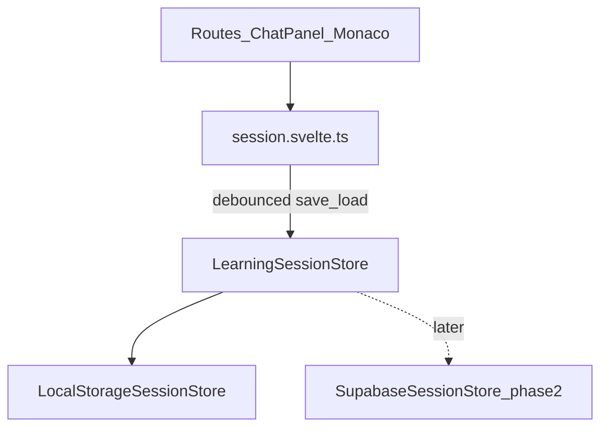

# Scaffy — Architecture & Design Decisions

This document records **why** Scaffy is built the way it is. It complements [`CLAUDE.md`](../CLAUDE.md), which holds short, agent-facing invariants synced to Cursor and GitHub Copilot.

| Audience  | Use                                                                                                         |
| --------- | ----------------------------------------------------------------------------------------------------------- |
| Humans    | Full context, alternatives, and status                                                                      |
| AI agents | Read relevant sections when changing chat, API, or state; keep `CLAUDE.md` in sync only for top-level rules |

**How to maintain:** When a decision changes, update the entry here (status, consequences). If agents must always obey it, add or adjust a short bullet in `CLAUDE.md` and sync `.cursor/rules/design-decisions.mdc` + `.github/copilot-instructions.md` in the same edit batch.

---

## Key decisions

Architecturally central ADRs — grouped by topic. Full context in each linked entry below.

| ADR                                                                                                                                                                                                                          | Topic                   | Related documentation                                                                                        |
| ---------------------------------------------------------------------------------------------------------------------------------------------------------------------------------------------------------------------------- | ----------------------- | ------------------------------------------------------------------------------------------------------------ |
| [ADR-002](#adr-002-spa-sveltekit-5-no-ssr-for-app-shell)                                                                                                                                                                     | Framework: SvelteKit    | [architecture.md §5](architecture.md#5-technologies-meta) · [svelte-health-check.md](svelte-health-check.md) |
| [ADR-010](#adr-010-repository-layout-typescript-and-quality-gates) · [ADR-016](#adr-016-routes-feature-views-vs-ui-components) · [ADR-017](#adr-017-ui-primitives-shadcn-first-scroll-area)                                  | Component architecture  | [README § Repository structure](../README.md#repository-structure)                                           |
| [ADR-009](#adr-009-session-store-for-scaffolds-monaco-later) · [ADR-007](#adr-007-chatpanel-dual-mode-and-state-ownership) · [ADR-014](#adr-014-learning-session-persistence-port--localstorage-first)                       | State handling          | [architecture.md §6](architecture.md#6-state-management)                                                     |
| [ADR-003](#adr-003-claude-only-via-server-api-routes) · [ADR-004](#adr-004-separate-api-endpoints-for-learn-and-ask) · [ADR-005](#adr-005-learn-scaffold-rest--structured-json) · [ADR-006](#adr-006-ask-chat-sse-streaming) | Secure API access       | [architecture.md §4](architecture.md#4-http-api-flows)                                                       |
| [ADR-011](#adr-011-monaco-viewzones-editor-integration-and-a11y-trade-off)                                                                                                                                                   | Monaco viewZones + a11y | [architecture.md §5 Monaco APIs](architecture.md#monaco-apis)                                                |

---

## Further decisions

All other ADRs (not grouped in Key decisions above). Full context in each linked entry below.

| ADR                                                                                  | Title                                            | Status                                                                                   |
| ------------------------------------------------------------------------------------ | ------------------------------------------------ | ---------------------------------------------------------------------------------------- |
| [ADR-001](#adr-001-product-vision-scaffolding--friction)                             | Product vision: scaffolding + friction           | Accepted                                                                                 |
| [ADR-008](#adr-008-chat-message-lifecycle-statuses)                                  | Chat message lifecycle statuses                  | Accepted                                                                                 |
| [ADR-012](#adr-012-ask-markdown-rendering-during-stream)                             | Ask markdown rendering during stream             | Accepted                                                                                 |
| [ADR-013](#adr-013-documentation-split-claudemd-vs-decisionsmd)                      | Documentation split: CLAUDE.md vs decisions.md   | Accepted                                                                                 |
| [ADR-015](#adr-015-home-vs-session-route-split)                                      | Home vs session route split                      | Accepted                                                                                 |
| [ADR-018](#adr-018-scaffy-modal-product-dialogs)                                     | ScaffyModal — unified product dialogs            | Accepted                                                                                 |
| [ADR-019](#adr-019-monaco-viewzone-aria-hidden-accepted)                             | Monaco viewZone aria-hidden — accepted trade-off | Superseded by [ADR-011](#adr-011-monaco-viewzones-editor-integration-and-a11y-trade-off) |
| [ADR-020](#adr-020-client-side-i18n-english--german-via-flat-translation-dictionary) | Client-side i18n (EN/DE)                         | Accepted                                                                                 |
| [ADR-021](#adr-021-session-intro-stream-and-lesson-start-gate)                       | Session intro stream + lesson start gate         | Accepted                                                                                 |
| [ADR-022](#adr-022-shadcn-vs-custom-ui-controls)                                     | shadcn vs custom UI controls                     | Accepted                                                                                 |

---

## ADR-001: Product vision — scaffolding + friction

**Status:** Accepted

### Context

Generic AI coding tools optimize for speed and full-file output. Scaffy targets **learning**: users should understand what they ship.

### Decision

- **Scaffolding:** Code is delivered in ordered steps (`scaffolds`), not one opaque blob.
- **Friction:** A knowledge check gates the next step until the user answers correctly (or acknowledges an explainer).
- **Punchline:** _"AI that teaches you to build good code, not just builds for you."_

### Consequences

- API and UI must support step index, questions, and progress (partially built; see ADR-009, ADR-011).
- Ask mode is a separate, low-friction tutor path (ADR-004), not a replacement for Learn.

---

## ADR-002: SPA — SvelteKit 5, no SSR for app shell

**Status:** Accepted

### Context

The session UI is highly interactive (Monaco, chat, resizable panes). SEO for the learning shell is not a priority.

### Decision

- SvelteKit 5 in **SPA mode** (no SSR/SSG for app pages).
- **Exception:** `src/routes/api/**` server routes run on the server for Claude proxying.
- Do not add `+page.server.ts` load functions for app routes outside `/api/`.

### Alternatives considered

- SSR for first paint — rejected; added complexity without clear benefit for v1.

### Consequences

- All learning UI state is client-side or via `fetch` to `/api/...`.
- Deployment fits Vercel adapter patterns already in the repo.
- **No search indexing:** `static/robots.txt` (`Disallow: /`) plus `<meta name="robots" content="noindex, nofollow">` in `app.html`.

---

## ADR-003: Claude only via server API routes

**Status:** Accepted

### Context

`ANTHROPIC_API_KEY` in the browser bundle or network tab would expose the key to anyone.

### Decision

```
Browser → POST /api/<endpoint> (SvelteKit) → api.anthropic.com
```

- Key via `import { ANTHROPIC_API_KEY } from '$env/static/private'`.
- `.env.local` for local dev; `.env.example` committed as template.
- Client never calls `api.anthropic.com`.

### Consequences

- Every new Claude capability gets its own thin `+server.ts` (or shared server helper), not client SDK usage.

---

## ADR-004: Separate API endpoints (Learn, Ask, Session intro)

**Status:** Accepted

### Context

Learn, Ask, and session intro need different system prompts, output shapes, temperatures, and transport.

### Decision

| Surface           | Route                     | Transport                | Output                                 | System prompt                                   |
| ----------------- | ------------------------- | ------------------------ | -------------------------------------- | ----------------------------------------------- |
| **Learn Code**    | `POST /api/scaffold`      | REST                     | Structured JSON `{ scaffolds: [...] }` | `src/lib/server/scaffold/system-prompt.md`      |
| **Ask**           | `POST /api/chat`          | Server-Sent Events (SSE) | Plain text stream                      | `src/lib/server/chat/system-prompt.md`          |
| **Session intro** | `POST /api/session-intro` | Server-Sent Events (SSE) | Plain text concept preview             | `src/lib/server/session-intro/system-prompt.md` |

- Server assets: one subfolder per endpoint under `src/lib/server/<endpoint>/`.
- Shared: `src/lib/server/anthropic-client.ts` (`@anthropic-ai/sdk`).

### Alternatives considered

- Single `/api/claude` with a `mode` flag — rejected; mixes unrelated config and is harder to test and tune.
- Reuse `/api/chat` for session intro — rejected (ADR-021); Ask history and Socratic prompt do not fit a one-shot preview.

### Consequences

- Three handlers to maintain; each can evolve independently (caching TTL, token limits, prompts).
- New sessions may run **scaffold REST + session intro (Server-Sent Events)** in parallel (ADR-021).

---

## ADR-005: Learn — scaffold REST + structured JSON

**Status:** Accepted

### Context

Scaffy needs a fixed shape: `codeSnippet` + `knowledgeCheck` per step, validated server-side. A **two-phase API experiment** (phase 1: scaffold 1, phase 2: scaffolds 2–5) was tried on branch `feature/19-…` and **reverted**: the model often ignored phase counts, **code drift** broke cumulative chains at phase boundaries, and Anthropic’s JSON Schema subset cannot express exact array counts — leading to repeated 502 errors and poor UX.

That fragility is **rooted in LLM non-determinism + structured-output constraints**, not fixable by validation alone. Scaffy is built for the module **„Frameworkbasierte UI-Entwicklung“** — deep API orchestration is off-topic; a **pragmatic** design is preferred.

### Decision

- **Single-shot** `POST /api/scaffold`: one request returns the **full lesson** (`LESSON_SCAFFOLD_COUNT = 3`).
- `client.messages.create` with `output_config.format.type: 'json_schema'` and schema from `output.schema.json` / `output-schema.ts`.
- **No API streaming** for scaffold: partial JSON is not reliably parseable.
- **Temperature ~0.3**, `max_tokens` 6144 — tuned in `src/routes/api/scaffold/+server.ts`.
- Post-parse: `validateStructuredOutput()` → `validate-lesson.ts` (trim to 3 scaffolds if the model over-generates; **strict cumulative** `codeSnippet` chain; one **server retry** on validation failure).
- **In-editor loading** while waiting (~45s): static `<!-- HTML comment -->` lines via `setValue()`; Braille spinner + rotating verbs in a Monaco **viewZone** (DOM updates only — no per-frame model edits).
- **Resilience:** client auto-retry once; error state with retry + static `scaffold-fallback.json` (dev paste from localStorage).
- **Prompt rules:** min 10 characters (Learn and Ask).

### Alternatives considered

- **Two-phase loading** — rejected after experiment (count mismatch, code drift, double failure rate).
- **Five scaffolds single-shot** — rejected in favor of **three** (shorter chain, fewer drift points; didactic beats merged).
- **Accepting code drift via normalization** — rejected (breaks cumulative Monaco lesson flow).

### Consequences

- Perceived “streaming” for scaffold **code** is **not shipped**: chunks apply via `editor.setValue()` when unlocked (typewriter via `executeEdits` still planned — ADR-011). Loading spinner animation is client-side in a viewZone.
- Learn chat UI does not show the raw JSON; scaffolds go to the session store (ADR-009).
- Session fetch: `ensureScaffold()` on `/session/[id]` when status is `loading` (resume after reload).

---

## ADR-006: Ask — chat Server-Sent Events (SSE) streaming

**Status:** Accepted

### Context

Ask is free-form Q&A; users expect token-by-token replies like other chat products.

### Decision

- `client.messages.stream()` in `src/routes/api/chat/+server.ts`.
- Proxy emits **Server-Sent Events (SSE)** — `Content-Type: text/event-stream`; one open HTTP response with many `data: …` lines. Event types: `ready`, `text` (delta), `done`, `error`.
- **Temperature 0.55**, **`max_tokens` 2048** (teaching replies; ladder: UI concept → Runes → syntax).
- **History cap:** last **30 messages** (~15 user/assistant turns) in `buildMessages()` — cost and context control; focused use per open question, not long threads.
- **No** structured output schema; **scaffolded Socratic** tutor prompt in `src/lib/server/chat/system-prompt.md` (teach mental model first, then questions + small steps; not interrogation-only; topic-agnostic for any scaffold lesson; no MC spoilers).
- **Prompt rules:** min 10 characters (same as Learn).
- **Lesson context** (current scaffold/knowledge check) — planned later; not in API body yet.
- Client: `src/lib/api/chat-stream.ts` appends deltas; `request.signal` / `AbortController` for cancel.

### Alternatives considered

- **Vercel AI SDK** — rejected for v1; extra dependency, React-centric; `@anthropic-ai/sdk` already present.
- REST `json({ reply })` — rejected; worse UX for long answers.

### Consequences

- ChatPanel must handle `loading` → `streaming` → `complete` (ADR-008).
- Assistant replies rendered as Markdown in Ask mode (ADR-012).

---

## ADR-007: ChatPanel dual mode and state ownership

**Status:** Accepted

### Context

The session view needs a prompt/response loop beside Monaco without tight coupling.

### Decision

- **`ChatPanel.svelte`** owns **local** chat UI state: messages, prompt input. **`mode`** is a required prop (`learn` | `ask`) set by the parent — no in-panel toggle.
- **`/` (home):** `ChatPanel` with `mode="learn"` and `promptOnly` — textarea only; **start session** calls `requestScaffold` then navigates to `/session/:id`. Scaffold + learning progress live in Monaco + session store (left pane).
- **`/session/[id]`:** `mode="ask"` — Server-Sent Events tutor via `/api/chat` in the right pane; **independent** of scaffold submission (no Generate lesson on session).
- **Ask** assistant text stays in `messages`; **Learn** success removes the loading placeholder (no success bubble).
- **Learn error UX:** assistant placeholder becomes `error` with message.
- Communication with Monaco is **only** through the session store (and future `editor` / `questions` stores), not props between panes.

### Consequences

- `+page.svelte` only lays out Monaco + `ChatPanel`; no shared props between them yet.
- Replacing the old API smoke-test panel (`claude-chat-panel.svelte`) was intentional.

---

## ADR-008: Chat message lifecycle statuses

**Status:** Accepted

### Context

Chat UIs need visible pending/loading/streaming/error states; the same model should extend to retries/cancel later.

### Decision

Types in `src/lib/types/chat-message.ts`:

| Status      | Meaning                                |
| ----------- | -------------------------------------- |
| `pending`   | Optimistic / sending (optional, short) |
| `loading`   | Request started, no content yet        |
| `streaming` | Ask: tokens arriving                   |
| `complete`  | Success, settled                       |
| `error`     | Failed; optional partial `content`     |

- `isThreadBusy()` disables send while any message is `pending` | `loading` | `streaming`.
- Ask history for the API: only `complete` user/assistant messages (`toChatHistory()`).
- UI: `chat-message.svelte` + `chat-message-list.svelte` (auto-scroll, `aria-live="polite"`).

### Consequences

- New features (retry, cancelled) should extend `ChatMessageStatus`, not ad-hoc booleans.

---

## ADR-009: Session store for scaffolds (Monaco later)

**Status:** Accepted (partial implementation)

### Context

Learn responses are not chat content; Monaco and question UI need a shared scaffold list.

### Decision

- `src/lib/session.svelte.ts`: `status` (`idle` | `loading` | `ready` | `error`), `scaffolds`, `errorMessage`.
- `startScaffoldRequest()` clears scaffolds and sets `loading`.
- Client-safe types in `src/lib/types/scaffold.ts`; server `output-schema.ts` imports them.

### Not yet implemented (planned)

- `editor.svelte.ts`, `questions.svelte.ts`, step index, localStorage progress, `/session/:id` routes.

### Consequences

- Do not import `$lib/server/*` from client components; share types via `$lib/types/`.

---

## ADR-010: Repository layout, TypeScript, and quality gates

**Status:** Accepted

### Context

The codebase will grow (Monaco, questions, more API surfaces). Conventions reduce navigation cost. API routes are the security boundary to Claude; regressions there should be caught before merge without slowing every commit.

### Decision

- **UI:** `src/lib/components/<area>/` (`chat`, `editor`, …); promote to `src/lib/features/<name>` if an area grows large.
- **API routes:** `src/routes/api/<endpoint>/+server.ts` — one folder per HTTP surface.
- **Server-only:** `src/lib/server/<endpoint>/` + shared `anthropic-client.ts`.
- **All application code:** TypeScript; Svelte `<script lang="ts">`; no new `.js` under `src/`.
- **README / code comments:** American English; chat with users may be German.

#### Quality gates, testing, and CI

- **Vitest** for unit tests. **v1 scope:** `src/routes/api/**` (co-located `server.test.ts` / `*.test.ts`) plus extracted helpers (e.g. `chat/utils.ts`). Anthropic SDK calls are **mocked** — no network or API credits. [`.env.test`](../.env.test) supplies stub env for CI and fresh clones (`cp .env.test .env` before sync/tests when `.env.local` is absent).
- **Local PR gate:** `pnpm run verify` runs `lint`, `check`, `check:i18n`, and `test:run` in one command.
- **CI (Option B — intentional):** [`.github/workflows/ci.yml`](../.github/workflows/ci.yml) runs the **same checks as `verify` but as separate steps** after `pnpm run ci` (frozen install). Granular GitHub logs show which gate failed; README documents a single local command instead of duplicating four blocks.
- **Pre-commit (Husky + lint-staged):** Prettier + ESLint on staged files; `check:i18n` when `translations.ts` is staged; **Vitest only when API/server code is staged:**
  - `src/routes/api/**/*.ts` → `vitest related --run` (affected tests only)
  - `src/lib/server/**/*.ts` → `pnpm run test:run` (full suite — mocks do not link server modules into the import graph)
  - UI, session store, and i18n-only commits skip tests; CI remains the safety net for `--no-verify`.
- **Agent workflow:** Agents format and lint per `.cursor/rules/format-and-lint.mdc`; **do not** run the full test suite on every agent edit — only when changing tested API/server surfaces.
- **Deferred:** component tests, Playwright E2E.

### Alternatives considered

| Alternative                                    | Why not                                                                                      |
| ---------------------------------------------- | -------------------------------------------------------------------------------------------- |
| **CI calls `pnpm run verify` only** (Option A) | One failing blob in Actions; harder to see which gate broke                                  |
| **Full `test:run` on every commit**            | Slow and noisy for UI/docs-only changes                                                      |
| **No pre-commit tests**                        | API regressions slip through until CI; related tests on staged API files are fast (~seconds) |

### Consequences

- New API routes should ship with co-located Vitest coverage and mocks for `$lib/server/*`.
- Keep `verify` script in sync with CI check steps (lint, check, check:i18n, test:run).
- See [`docs/architecture.md` §5 Testing](architecture.md#testing) for covered files.

### Models (implementation note)

Code uses logical IDs `claude-sonnet-4-5` | `claude-sonnet-4-6` mapped in `anthropic-client.ts`. Older docs mentioning `claude-sonnet-4-20250514` are stale relative to the repo.

---

## ADR-011: Monaco viewZones, editor integration, and a11y trade-off

**Status:** Accepted — **viewZone shipped**; typewriter **not implemented**

### Context

Learn mode should feel like live typing without API streaming of JSON. The Learning Card must scroll with code (viewZone), not as a detached overlay. Lighthouse reports **`aria-hidden-focus`** because Monaco marks `.view-zones` as `aria-hidden="true"` while interactive quiz controls live inside the zone.

### Decision

- Integrate `monaco-editor` in the learn loop (`monaco-editor.svelte`).
- Show **`learning-card.svelte`** (UI label: **Learning Card**) in a Monaco **viewZone** after the last code line — `KnowledgeViewZoneController` mounts the card into the zone DOM; `ResizeObserver` keeps `heightInPx` in sync. Scrolls with editor content (no viewport-clamped overlay).
- **Loading spinner** (while scaffold generates): same viewZone API — `LoadingSpinnerViewZone` after the comment block; static comments in the model, animated spinner in zone DOM (`monaco-scaffold-loading.ts`).
- Reveal each `codeSnippet` with `editor.executeEdits()` ~15 ms per character — **planned, not shipped**.
- Unlock next scaffold only after a correct answer (session store today; dedicated `questions` store optional later).
- **Editor read-only** until `session.completed` — selection/copy allowed on **code**; typing blocked (`readOnly: true`, not `domReadOnly`).
- **Learning Card copy prevention** — question and answer options are not selectable/copyable (`user-select: none`, `copy` blocked on the card root). **Intentional friction:** stops learners from pasting the gated quiz into the Ask chat pane beside the editor to shortcut the knowledge check. Monaco code remains copyable; the wrong-answer feedback modal (portaled) is separate and may still expose the explanation after a failed attempt.

### Accessibility trade-off

- **Keep Learning Card in a Monaco viewZone** — scroll-with-code is core pedagogy.
- **Do not** move interactive knowledge checks to **overlay widgets**, portaled panels, or other DOM outside the viewZone solely to satisfy `aria-hidden-focus`.
- **Accept** the resulting automated a11y finding; session Lighthouse accessibility is ~96 — we do not target 100 on `/session/*`.
- **Ignore** `aria-hidden-focus` in Lighthouse/PageSpeed triage unless product requirements change.
- Wrong-answer feedback and read-only hint remain portaled; only the inline gated quiz stays in the viewZone.

### Alternatives considered

- Allow copy and rely on honor system — rejected; Ask mode is one click away and would undermine the gate.
- Block copy on the entire editor — rejected; copying scaffold code for notes is a valid learning action.
- **Monaco overlay widget** for the Learning Card — rejected; decouples the card from line-aligned scroll position.
- **Portal Learning Card to `document.body`** — rejected for the quiz; used only for read-only hint and wrong-answer modal.

### Current state

- ViewZone integration: `monaco-knowledge-view-zone.ts` (Learning Card), `monaco-scaffold-loading.ts` (loading spinner); styled via `monaco-editor.css` / `learning-card.css`.
- Code still applied via `editor.setValue()` (full chunk at once).
- Wrong-answer feedback: portaled to `document.body` (`z-index` above app chrome); structured layout (correct option row + explanation).
- Read-only edit hint: custom portaled tooltip (`read-only-hint.svelte`), not Monaco `readOnlyMessage`.
- Session route may retain `aria-hidden-focus` in audits; no agent or refactor should “fix” it without an explicit product decision to reverse this ADR.

---

## ADR-012: Ask markdown rendering during stream

**Status:** Accepted

### Context

Claude Ask replies are often Markdown (`**bold**`, fenced code). Plain `whitespace-pre-wrap` showed raw syntax.

### Decision

- **Scope:** Assistant messages in **Ask** mode only (`chat-message.svelte` → `ChatMarkdown.svelte`). User bubbles, Learn mode, and errors stay plain text.
- **Libraries:** `marked` (GFM) + `dompurify` in `src/lib/components/ui/markdown/render-markdown.ts` (client-only). Shared by `MarkdownContent.svelte` (static copy, e.g. About dialog) and `ChatMarkdown.svelte` (Ask streaming).
- **Streaming:** Re-parse on **`requestAnimationFrame`** while `status === 'streaming'` (at most ~60 renders/s). On `complete`, parse immediately without waiting for rAF.
- **Output:** Sanitized HTML via `{@html}` inside `prose prose-sm dark:prose-invert` (`@tailwindcss/typography` in `layout.css`).
- **Cursor:** Streaming caret rendered after the markdown block in `ChatMarkdown.svelte`.

### Alternatives considered

- Complete-only — simpler; rejected for ChatGPT-like live formatting.
- Parse on every SSE token — rejected (performance).

### Consequences

- Open code fences may flicker until closed during stream.
- Syntax highlighting (Shiki) not included in v1.
- Dependencies: `marked`, `dompurify`, `@tailwindcss/typography`.

---

## ADR-013: Documentation split — CLAUDE.md vs decisions.md

**Status:** Accepted

### Context

Agent config files must stay small and synced across three tools; detailed rationale does not belong triple-copied.

### Decision

| Layer            | Location                                                                             | Content                                     |
| ---------------- | ------------------------------------------------------------------------------------ | ------------------------------------------- |
| Agent invariants | `CLAUDE.md`, `.cursor/rules/design-decisions.mdc`, `.github/copilot-instructions.md` | Stable rules agents must follow             |
| Decision log     | **`docs/decisions.md`** (this file)                                                  | Context, alternatives, status, consequences |
| Product brief    | `docs/projektsteckbrief-scaffy.md`                                                   | German stakeholder view                     |
| Operational      | `docs/*.md` (e.g. test prompts)                                                      | Runbooks, fixtures                          |

- New architectural choices: add or update a section here; add a **one-line pointer** in `CLAUDE.md` only when agents need to know the rule exists.
- **Enforcement:** [`.cursor/rules/decisions-log.mdc`](../.cursor/rules/decisions-log.mdc) (`alwaysApply: true`) — agents must update this file when finishing **Agent-mode** implementation (including work that followed **Plan** or **Ask**): ADR status, index, changelog.

### Consequences

- Reduces drift between “essay in three agent files” vs “undocumented code comment.”
- Plan/Ask → Agent handoffs should end with ADR status matching shipped code.

---

## ADR-014: Learning session persistence port — localStorage first

**Status:** Accepted — **localStorage shipped inline** in [`session.svelte.ts`](../src/lib/session.svelte.ts); **persistence port / adapter pattern deferred**

### Context

Learning progress must survive reloads and back navigation ([`projektsteckbrief-scaffy.md`](projektsteckbrief-scaffy.md): `/session/:id`, `/sessions`, step index, answered knowledge checks). We considered persisting directly in **Supabase** with **Google Auth** and **RLS** (cross-device, per-user rows). That path needs dashboard setup, OAuth redirects, env secrets on Vercel, and sync/error UX before the core learn loop is proven in the UI.

[`session.svelte.ts`](../src/lib/session.svelte.ts) already holds **runtime** scaffold data for Learn; persistence is a separate concern from ChatPanel and Claude API routes.

### Current state (shipped)

- [`session.svelte.ts`](../src/lib/session.svelte.ts) persists `SessionRecord[]` and the active session id to `localStorage` on change; restores on load.
- Sessions overview page and session tabs read from the same store; no separate `LocalStorageSessionStore` adapter or `LearningSessionStore` port yet.
- Step-level progress (current scaffold index, answered Learning Cards) is **not** fully persisted across reload — only session list, scaffolds payload, and `completed` flag.
- **Ask chat** per session: `askMessages` on `SessionRecord` in the singleton — survives SPA navigation; **stripped** from `localStorage` JSON (lost on full reload).
- Supabase adapter remains Phase 2 (optional).

### Decision (target architecture)

**Phase 1 — `localStorage` via a persistence port (adapter-friendly), not ad-hoc `localStorage` calls in components.**

1. Define a small **port** (interface) for durable learning sessions, e.g. `LearningSessionStore`:
   - `load(id)`, `save(session)`, `listHistory()` (and optional `delete(id)`)
   - Uses shared domain types (e.g. `LearningSession` in `$lib/types/`), not raw scaffold JSON scattered in UI code.

2. Implement **`LocalStorageSessionStore`** as the first **adapter** — wraps `localStorage` behind that interface.

3. Keep **`session.svelte.ts`** as the **in-memory** source of truth while the user is on an active session (Monaco, questions, current step). The store triggers **debounced** `save()` on the port; on route enter (`/session/:id`), **`load()`** hydrates the runtime store.

4. **Factory** (e.g. `createSessionStore()`) returns the active adapter so call sites depend on the port only — never `localStorage` or `@supabase/supabase-js` directly in Svelte components.

**Phase 2 (later, optional) — `SupabaseSessionStore` adapter**

- Same port methods; Supabase Auth (e.g. Google) + Postgres + **RLS** (`user_id = auth.uid()`).
- Factory switches (or composes) adapters when the user is signed in — no rewrite of routes or `session.svelte.ts` consumers.
- Optional: on first login, migrate local sessions from `localStorage` into Supabase (separate task, not required for Phase 1).

**Sync failures (any adapter):** runtime state may advance before persist completes; expose `syncStatus` (`syncing` | `synced` | `error`) and retry — do not imply “saved” without a successful `save()`. After reload, **loaded data from the port wins** over stale memory.



### Why localStorage first (now)

| Reason                   | Detail                                                                                                                            |
| ------------------------ | --------------------------------------------------------------------------------------------------------------------------------- |
| **Unblock product loop** | Step gating, `/session/:id`, `/sessions` testable without Supabase project or OAuth                                               |
| **Lower setup cost**     | No Google Cloud OAuth client, Supabase redirect URLs, or `PUBLIC_*` / service keys for v1                                         |
| **Aligns with SPA**      | Fits current anonymous, single-browser use; matches steckbrief “anonymous session id via `crypto.randomUUID()`” until auth exists |
| **Avoid throwaway work** | Port + adapter boundary prevents a later Supabase migration from touching every component                                         |

### Alternatives considered

| Alternative                             | Why not now                                                                                                                                                              |
| --------------------------------------- | ------------------------------------------------------------------------------------------------------------------------------------------------------------------------ |
| **Supabase only from day one**          | Higher calendar and ops cost before Monaco/questions/history UI exist; auth blocks all testing                                                                           |
| **Raw `localStorage` in components**    | Hard to swap to Supabase; violates single place for schema/versioning of stored JSON                                                                                     |
| **TanStack Query as persistence layer** | [TanStack Query](https://tanstack.com/query/latest) helps cache/refetch **server** state; optional later for History when using Supabase — not a substitute for the port |
| **Persist only in URL**                 | URL length limits; poor fit for full `scaffolds` JSON and answer history                                                                                                 |

### Consequences

- New code under something like `$lib/persistence/` (`LearningSessionStore`, `local-storage-session-store.ts`, `create-session-store.ts`).
- **Do not** import `$lib/server/*` from persistence adapters on the client; Supabase adapter uses `@supabase/supabase-js` + anon key + user JWT when added.
- Ask-mode chat: **in-memory** on `SessionRecord.askMessages` (navigation only); **not** in the localStorage port unless explicitly extended later.
- When `SupabaseSessionStore` ships: add ADR changelog line, implement adapter + factory branch, document env vars in `.env.example` — **supersede nothing in Phase 1 port shape** unless a breaking schema change is intentional.

### Implementation checklist (for agents)

- [ ] `LearningSession` type (id, prompt, scaffolds, `currentStep`, answered checks, timestamps)
- [ ] `LearningSessionStore` interface
- [ ] `LocalStorageSessionStore` (+ namespaced keys, JSON parse errors handled)
- [ ] `createSessionStore()` — Phase 1 returns local adapter only
- [ ] Wire load/save from `session.svelte.ts` or a thin `session-persistence.svelte.ts` helper
- [ ] Routes `/session/:id`, `/sessions` use the port, not storage APIs directly

---

## ADR-015: Home vs session route split

**Status:** Accepted

### Context

The app previously rendered Monaco + ChatPanel on `/`. The product needs a focused prompt-entry home screen (no editor) and a separate session workspace. PR #21 merged localStorage session tabs on `/`; this ADR splits routes while **preserving** tab UI and store behavior on `/session/[id]`.

### Decision

- **`/`** — `StartLearningSession`: learn/scaffold only (`promptOnly` + **start session** → `requestScaffold`).
- **`/session/[id]`** — `SessionWorkspace`: **Monaco + tabs (learn progress)** left; **`ChatPanel mode="ask"`** right (SSE tutor, unrelated to scaffold).
- **`/sessions`** — `SessionsPage`: list of `getSessions()` from localStorage; select opens `/session/:id`. **`/history`** redirects to `/sessions`.
- **App shell:** `AppTitleBar` in root `+layout.svelte` — persistent top nav (**scaffy** brand + **My Sessions** + optional session title with chevron on `/session/[id]`); cyan underline (`border-ring`) marks the active segment; logo and **scaffy** text both link to `/`; About dialog. No shadcn Breadcrumb.
- **`/sessions` empty state:** when `getSessions()` is empty, centered copy + **Start your first learning session** → `/`.
- **Navigation:** **start session** on home calls `requestScaffold` and `goto('/session/:id')`.
- **Session id alignment:** `startScaffoldRequest(prompt, preferredId?)` uses the route id so Home navigation and localStorage tabs stay consistent.
- **Example chips:** copy text into the chat textarea via DOM (`#chat-prompt`) to avoid ChatPanel prop changes.
- **Design tokens:** shadcn semantic vars + `--scaffy-*` accents in `layout.css` (`@theme inline` → Tailwind utilities). Logo uses inline `scaffy-logo.svelte` bound to `--scaffy-logo-*` / `--card`.

### Alternatives considered

- Shared layout wrapping home + session — rejected; zero UI overlap between the two shells.
- `session-bootstrap.svelte.ts` store — deferred to avoid merge conflicts with ADR-014 localStorage work.
- ChatPanel `layout="home"` props — deferred; CSS hides message list and built-in submit on home only.

### Consequences

- Sessions and scaffold payloads persist across reload via inline `localStorage` in `session.svelte.ts`; step index within an in-progress session is not yet restored (see ADR-014 current state).
- Tab select navigates via `goto('/session/:id')`; closing the last tab returns to `/`.
- New files: `src/lib/components/home/*`, `src/lib/components/session/*`, `src/routes/session/[id]/+page.svelte`, `src/routes/sessions/+page.svelte`, `src/lib/components/sessions/sessions-page.svelte`.

---

## ADR-016: Routes, feature views, vs ui/ components

**Status:** Accepted

### Context

Scaffy grew separate surfaces (home, session, sessions overview) plus shared chrome (`AppTitleBar`) and shadcn-style primitives. Without a clear split, agents and contributors mix **route files**, **screen-specific views**, and **generic UI** (e.g. example prompt lists inside `ui/`, or fat `+page.svelte` files). SvelteKit already encodes URLs in `src/routes/`; duplicating “page” in filenames adds noise.

### Decision

**Four layers:**

1. **`src/routes/` — routing only**
   - Folder path = URL (`/`, `/sessions`, `/session/[id]`; `/history` redirects to `/sessions`).
   - `+page.svelte` stays **thin**: import one view component from `lib/`, render it.
   - **Lazy route (conditional):** `routes/sessions/+page.svelte` — empty state inline (instant when no sessions); `sessions-page.svelte` loads via dynamic `import()` only when `getSessions().length > 0`.
   - No `-page` suffix on route files; use SvelteKit conventions (`+page.svelte`, `+layout.svelte`).

2. **`src/lib/components/<area>/` — feature / area views**
   - Subdirectories by product area: `home/`, `sessions/`, `chat/`, `editor/`, `shell/`, …
   - Holds **domain context**: user-facing copy, example data, store/API wiring, screen layout.
   - Names describe the **feature** (`start-learning-session.svelte`, `sessions-page.svelte`), not the URL tree.
   - `-page` suffix on lib components is **optional** when it signals “view for a single route.”

3. **`src/lib/components/ui/` — generic UI primitives**
   - Domain-agnostic, reusable controls built on **shadcn-svelte** (Button, Card, Dialog, Toggle Group, …).
   - Prefer composing from installed shadcn components; add via `pnpm dlx shadcn-svelte@latest add <name>` before hand-rolling markup.
   - **Props in, events out** — no hardcoded product strings, example lists, or fetches.
   - Example: `ChipGrid` uses shadcn `Button`; `start-learning-session.svelte` uses `Card` + `Button` with home token overrides.

4. **`src/lib/assets/` — static media**
   - SVGs, images; themed logo as `scaffy-logo.svelte` (CSS vars). Import from feature views.
   - Avoid a Svelte wrapper unless dynamic sizing or CSS-variable theming inside the SVG is required.

**Agent rule:** When adding a component, if it is unclear whether it belongs in `ui/` vs `<area>/`, **ask the user before creating the file** (see `.cursor/rules/component-layout.mdc`).

### Examples (this repo)

| Piece           | Location                                                  | Why                                               |
| --------------- | --------------------------------------------------------- | ------------------------------------------------- |
| `/` route shell | `routes/+page.svelte` → `StartLearningSession`            | Thin route                                        |
| `/sessions`     | `routes/sessions/+page.svelte` → empty static / list lazy | Empty state eager; list chunk when sessions exist |
| Home screen     | `components/home/start-learning-session.svelte`           | Copy, ChatPanel wiring, examples                  |
| Chip grid       | `components/ui/chip/chip-grid.svelte`                     | Generic; no “Try one of these” inside             |
| Logo            | `lib/assets/scaffy-logo.svelte`                           | Themed inline SVG (`--scaffy-logo-*`)             |
| App chrome      | `components/shell/app-title-bar.svelte`                   | Cross-route shell, not `ui/`                      |

### Alternatives considered

- **Fat `+page.svelte` with all markup** — rejected; hard to test and reuse.
- **Everything under `ui/`** — rejected; leaks domain into primitives.
- **`-page` on all route views in `lib/`** — optional convention only; routes themselves stay `+page.svelte`.

### Consequences

- Extends [ADR-010](#adr-010-repository-layout-typescript-and-quality-gates); does not replace it.
- New Cursor rule: `component-layout.mdc` (`alwaysApply: true`).
- Promote large areas to `src/lib/features/<name>/` when `components/<area>/` outgrows maintainability (unchanged from ADR-010).

---

## ADR-017: ui/ primitives — shadcn-first; ScrollArea

**Status:** Accepted

### Context

Scrollable regions were first implemented as a hand-rolled `ScrollArea` (native `overflow` + global `.scaffy-scroll-area` CSS in `layout.css`). That diverged from other `ui/` primitives (Dialog, Accordion, Button), which come from **shadcn-svelte** + **bits-ui**, and caused layout bugs (flex height chain) and inconsistent styling (component vs raw CSS class on markdown `<pre>`).

ADR-016 already says to add shadcn components via CLI before hand-rolling; this ADR makes that rule explicit for scroll containers and records the one allowed CSS-only exception.

### Decision

1. **`ScrollArea` is shadcn-svelte** — installed via `pnpm dlx shadcn-svelte@latest add scroll-area`. Files live under `src/lib/components/ui/scroll-area/` (`scroll-area.svelte`, `scroll-area-scrollbar.svelte`, `index.ts`). Feature code imports `{ ScrollArea }` and uses `orientation` (`vertical` | `horizontal` | `both`). Programmatic scroll uses `bind:viewportRef` (bits-ui viewport), not `bind:ref` on the root.

2. **Scrollbar styling (single source)** — `scroll-area.css` (imported from `layout.css`) defines `--scaffy-scrollbar-*` tokens and inset rules for `[data-slot='scroll-area-scrollbar']`. `scroll-area-scrollbar.svelte` holds thumb/track classes only; no per-page overrides. **All product scroll surfaces use `type="hover"`** (default in `scroll-area.svelte`) — fade in on pointer enter, fade out on leave; same behavior as Monaco (`monaco-editor.css`). Do **not** use `type="always"` / `type="scroll"` in modals or feature views. Agent rule: `.cursor/rules/scrollbars.mdc`.

3. **Layout** — `ScrollArea` carries size/flex classes only; **content padding** belongs on inner wrappers so the scrollbar gutter is uniform. Root keeps `overflow-hidden min-h-0` for flex/grid parents.

4. **Custom `ui/` components** — allowed when they **compose** shadcn primitives without a matching registry item (e.g. `ChipGrid` uses Button + Tooltip) or when an ADR documents an exception. New bare primitives that shadcn provides → CLI first.

5. **Markdown `<pre>` exception** — sanitized HTML from `ui/markdown/render-markdown.ts` cannot wrap code blocks in Svelte. Those blocks use **`native-scroll-x`** (`scroll-area.css`, same CSS variables). Native OS scrollbar is acceptable here only.

6. **`index.ts` barrel** — every `ui/<name>/` folder exports `Root` plus a PascalCase alias, matching shadcn convention.

### Alternatives considered

- **Keep custom native ScrollArea** — rejected; duplicated shadcn patterns, fragile flex scrolling, split styling (`scaffy-scroll-area` vs components).
- **shadcn for markdown `<pre>`** — not feasible without parsing/wrapping in Svelte; CSS fallback documented instead.

### Consequences

- Removed `.scaffy-scroll-area*` rules from `layout.css`.
- `.cursor/rules/component-layout.mdc` references ADR-017 for ui/ install policy.
- `.cursor/rules/scrollbars.mdc` enforces hover-fade scrollbars app-wide (ScrollArea, Monaco, ScaffyModal).
- Monaco and other third-party scroll surfaces use the same `--scaffy-scrollbar-*` tokens (Monaco in scope).

---

## ADR-018: ScaffyModal — unified product dialogs

**Status:** Accepted

### Context

Delete confirmation, Learning Card wrong-answer feedback, and About each used separate markup and CSS (shadcn `Dialog.Content` for About; duplicated overlay/card/button styles elsewhere). Headers, shadows, button order, and error styling diverged.

### Decision

1. **`ui/scaffy-modal/`** — composed modal shell: `ScaffyModal` (portaled overlay + card), `ScaffyModalHeader` (icon + title), `ScaffyModalBody`, `ScaffyModalActions`, `ScaffyModalButton`. Global styles in `scaffy-modal.css` (imported from `layout.css`).

2. **Variants** — `default` (cyan icon/border) and `error` (destructive red). Sizes: `md` (28rem) and `lg` (About, ~92vw / max 80rem).

3. **Actions** — secondary left, primary/danger right (`justify-end`, DOM order). Single-action dialogs (feedback, About close) use one primary button on the right.

4. **Behavior** — portaled to `document.body`; `--scaffy-z-modal: 110`; Escape and **backdrop click** dismiss via `onDismiss` (default). Delete backdrop = cancel; feedback backdrop = „Verstanden“; About = close.

5. **shadcn Dialog** — retained for generic/registry use elsewhere; product-facing modals (About, delete, feedback) use ScaffyModal. About composes shadcn `ScrollArea` + `Accordion` inside the body only.

6. **Scrollable body** — `ScaffyModalBody` with `scroll` wraps content in shadcn `ScrollArea` (default `type="hover"` — same fade as Monaco). `size="lg"` cards use CSS grid (`auto minmax(0,1fr) auto`) and `height: min(85vh, …)` so the middle row constrains and scrolling works.

### Alternatives considered

- **Extend shadcn Dialog styling** — rejected; product modals need fixed icon header, pixel-specific chrome, and variant borders not aligned with shadcn defaults.
- **One mega Svelte file per dialog** — rejected; subcomponents keep feature views thin.

### Consequences

- `delete-confirmation-dialog.svelte`, `learning-card.svelte` feedback, and `about-dialog.svelte` import `ui/scaffy-modal`.
- Domain-only feedback body styles remain in `learning-card.css`.
- `--scaffy-z-knowledge-feedback` consolidated to `--scaffy-z-modal`; `--destructive-foreground` token added.

---

## ADR-019: Monaco viewZone aria-hidden — accepted trade-off

**Status:** Superseded by [ADR-011](#adr-011-monaco-viewzones-editor-integration-and-a11y-trade-off)

The aria-hidden / Lighthouse trade-off for Learning Cards in Monaco viewZones is documented under **ADR-011** (Accessibility trade-off). This entry is kept for index continuity only.

---

## ADR-021: Session intro stream + lesson start gate

**Status:** Accepted

### Context

Starting a session from home left the Ask panel empty for 10–30s while Monaco showed a loading spinner. Users had nothing to read and might not realize the chat is for questions during the lesson.

### Decision

- **`POST /api/session-intro`** — SSE stream with a dedicated system prompt (`src/lib/server/session-intro/system-prompt.md`); ephemeral system-prompt cache (`5m`) like `/api/chat` and `/api/scaffold`.
- **Parallel to scaffold fetch** — `ensureSessionIntro(sessionId)` runs alongside `ensureScaffold` when `session.status === 'loading'`.
- **Intro slot in Ask thread** — fixed message IDs (`intro-user`, `intro-assistant`); user bubble = session prompt; assistant streams concept preview (SFC, Runes, props — no solution code).
- **Lesson start gate** — Monaco does not call `loadNextScaffold()` until `lessonStarted` is true; user clicks **Got it — start lesson** (existing shadcn `Button` in `ChatPanel`).
- **Ask during intro** — intro stream does not block the Ask composer (`isAskComposerBusy` excludes intro message IDs).
- **Retry / fallback** — scaffold retry clears chat and re-runs intro; fallback loads scaffolds and **regenerates** intro in-place (overwrite assistant bubble + stream animation).
- **In-memory only** — `introStatus`, `lessonStarted`, intro messages follow ADR-014 (not localStorage); restored sessions with existing scaffolds skip the gate (`lessonStarted: true`).

### Alternatives considered

- Reuse `/api/chat` with an intent flag — rejected; Socratic Ask prompt and history semantics do not fit a one-shot preview.
- Scroll-to-bottom or checkbox in model output — rejected; compliance theater; CTA is client UI only.

### Consequences

- Two Claude calls per new session (scaffold REST + intro SSE); intro failure does not block scaffold.
- Intro content is inferred from the user prompt only — may diverge from scaffold steps; prompt uses cooperative tone without hedging (“vermutlich”).
- UI footer hint (“Ask questions here…”) is static app copy, not model output.

---

## ADR-020: Client-side i18n (English + German) via flat translation dictionary

**Status:** Accepted

### Context

Scaffy ships an English UI but targets German-speaking learners (course language is German). We need a runtime language switch (EN/DE) for the app chrome across Home, Sessions, Session, and About. As a pure SPA (ADR-002) the choice must work without SSR and persist the user's selection.

### Decision

- **One language file** — `src/lib/i18n/translations.ts` holds English messages in `EN_MESSAGES` (`as const`) and German in `DE_MESSAGES`, keyed by dotted ids (`app.*`, `home.*`, `sessions.*`, `session.*`, `about.*`). All user-facing copy, including About FAQ (`about.faq.<id>.question|answer`), lives here.
- **`MessageKey` type** — `export type MessageKey = keyof typeof EN_MESSAGES`. `t(key: MessageKey)` and the derived `messages` store (`Record<MessageKey, string>`) catch typos in components at compile time via `pnpm run check`.
- **Store + `t()`** — `src/lib/i18n/index.ts` exposes a `language` writable (persisted to `localStorage` under `scaffy.language`), a derived `messages` store used in components as `$messages['key']`, and a `t(key, params)` helper for non-reactive lookups with `{param}` interpolation.
- **EN/DE key parity** — `pnpm run check:i18n` (`scripts/check-i18n-keys.ts`) fails when a key exists only in `en` or only in `de`. Runs on every CI push/PR; Husky `lint-staged` runs it only when `translations.ts` is staged. Not part of `pnpm run lint`.
- **Markdown stays in `.md` files** — the About intro is the documented exception (long-form markdown rendered via `MarkdownContent`); localized as `about-content.md` (en) + `about-content.de.md` (de), selected by `$language`. `about-faq.ts` keeps only the ordered ids; FAQ copy lives in the translation file. Dynamic FAQ keys in `about-dialog.svelte` (template literals) are intentionally untyped.
- **Structured example data stays in typed modules** — the Home example prompts keep their `{ label, prompt }` shape in `example-prompts.ts` but become a `Record<LanguageCode, readonly ExamplePrompt[]>` selected by `$language`, rather than flattening multi-sentence prompt bodies into the dictionary.
- **Default language** is English; unknown/missing keys fall back to the key string.

### Alternatives considered

- **`svelte-i18n` / Paraglide / inlang** — rejected for now; the string surface is small and a dependency-free dictionary keeps the SPA bundle and tooling simple.
- **`satisfies Record<MessageKey, string>` on `de`** — rejected; EN/DE parity is enforced by `check:i18n` instead of widening compile-time checks on the German block.
- **Per-component copy constants** — rejected; scatters translations and prevents a single source of truth.
- **Putting About markdown into the dictionary** — rejected; multi-paragraph markdown is unreadable as a TS string and loses `.md` tooling.

### Consequences

- New user-facing strings must be added to **both** `en` and `de` in `translations.ts`; `check:i18n` blocks merge when keys diverge.
- Components reference `$messages` / `t()` with `MessageKey` literals — typos fail `svelte-check`, not at runtime.
- Localized long-form content uses paired `*.md` / `*.de.md` files selected by `$language`; localized structured data (e.g. example prompts) uses a `Record<LanguageCode, …>` keyed by `$language`.
- No SSR locale negotiation; the first paint uses the persisted or default language.

---

## ADR-022: shadcn vs custom UI controls

**Status:** Accepted

### Context

ADR-017 sets **shadcn-first** for `ui/` primitives but does not record which controls we deliberately skipped. Without a short inventory, agents may either hand-roll complex widgets (focus traps, keyboard nav) or install full shadcn kits for two-option menus.

### Decision rule

| Prefer **shadcn-svelte** (+ bits-ui) when…                                    | Prefer **custom / compose** when…                                     |
| ----------------------------------------------------------------------------- | --------------------------------------------------------------------- |
| Focus trap, portal, Escape, roving tabindex, or ARIA patterns are non-trivial | Behavior is a few lines (static list, click-outside, toggle open)     |
| The control is reused across many surfaces                                    | One screen owns the markup (title bar, session tabs, Monaco viewZone) |
| Styling matches registry defaults with token tweaks                           | Product chrome diverges from shadcn (modal header, variant borders)   |
| No sensible composition from existing primitives                              | Trigger already is shadcn `Button`; only the menu panel is plain HTML |

**Default:** `pnpm dlx shadcn-svelte@latest add <name>` before a new bare primitive. Document exceptions here or in a linked ADR.

### Installed shadcn primitives (in use)

| Primitive                    | Why shadcn                                                                          |
| ---------------------------- | ----------------------------------------------------------------------------------- |
| **Button**, **Card**         | Shared variants/sizes across Home, chat, sessions, title bar                        |
| **ScrollArea**               | Flex height chain + hover-fade scrollbars (ADR-017); used in chat, sessions, modals |
| **Tooltip**                  | Portal + positioning; composed in `ChipGrid`, chat actions                          |
| **Accordion**                | Keyboard + expand/collapse in About FAQ                                             |
| **Resizable**                | Pane drag/keyboard split in session workspace                                       |
| **Dialog**                   | Registry baseline only; **not** used for product modals (see ScaffyModal)           |
| **Toggle** / **ToggleGroup** | Installed for parity; no feature dependency yet                                     |

### Custom or composed (not full shadcn kits)

| Control                          | Location                      | Why not shadcn                                                                                                                                                           |
| -------------------------------- | ----------------------------- | ------------------------------------------------------------------------------------------------------------------------------------------------------------------------ |
| **ScaffyModal**                  | `ui/scaffy-modal/`            | Product modal chrome (icon header, variants, backdrop rules) does not fit extending `Dialog` — ADR-018                                                                   |
| **ChipGrid**                     | `ui/chip/`                    | Composes **Button** + **Tooltip**; no registry item                                                                                                                      |
| **MarkdownContent**              | `ui/markdown/`                | Streaming Ask markdown + DOMPurify; no shadcn equivalent — ADR-012                                                                                                       |
| **`native-scroll-x` on `<pre>`** | `scroll-area.css`             | Sanitized HTML cannot wrap code blocks in Svelte — ADR-017                                                                                                               |
| **ScaffyDropdown**               | `ui/scaffy-dropdown/`         | Lightweight listbox menu; built-in toolbar **Button** trigger (label + chevron). **DropdownMenu** kit avoided for ≤3 static items — first use: language in `AppTitleBar` |
| **AppTitleBar nav**              | `shell/app-title-bar.svelte`  | Custom segment nav + active underline; shadcn **Breadcrumb** was tried and removed — ADR-015                                                                             |
| **SessionTabs**                  | `session/session-tabs.svelte` | Domain tab strip (truncate prompt, delete affordance)                                                                                                                    |
| **Learning Card**                | `editor/learning-card.svelte` | Monaco viewZone + friction UX; not a generic primitive — ADR-011                                                                                                         |

### Not installed (evaluate before adding)

**DropdownMenu**, **Select**, **Popover**, **Breadcrumb** — add via CLI only when a surface needs full menu semantics (many items, submenus, typeahead, form-integrated select). A toolbar with ≤3 static choices stays on **Button** + minimal markup.

### Consequences

- Language switch documents the lightweight-dropdown pattern; future title-bar menus follow the same rule.
- ADR-017 remains the install policy; this ADR is the **inventory + heuristic** for reviews and agents.
- Revisit when a third locale or complex menu appears — then install **DropdownMenu** once and migrate **ScaffyDropdown** call sites that need submenus or typeahead.

---

## Planned / nice-to-have (not ADRs yet)

- Supabase adapter + Google Auth (see [ADR-014](#adr-014-learning-session-persistence-port--localstorage-first) Phase 2)
- Analytics (e.g. Tinybird)
- **Lottie** animations/icons (e.g. loading, empty states, success feedback in chat or session UI)

---

## Changelog

| Date       | Change                                                                                                                                                                          |
| ---------- | ------------------------------------------------------------------------------------------------------------------------------------------------------------------------------- |
| 2026-06-29 | Removed redundant full ADR index table; navigation via Key decisions + Further decisions only.                                                                                  |
| 2026-06-29 | ADR-010: Vitest API unit tests, `pnpm run verify`, CI Option B (separate steps), lint-staged Vitest on staged API/server files only.                                            |
| 2026-06-24 | Key decisions + Further decisions tables; ADR-011 merged with ADR-019 (a11y trade-off); ADR-019 superseded. Projektsteckbrief checklist aligned.                                |
| 2026-06-24 | ADR-022: shadcn vs custom UI inventory (ScaffyDropdown, ScaffyModal, ChipGrid, etc.) and when to install vs compose.                                                            |
| 2026-06-25 | ADR-020: `MessageKey` compile-time checks; `check:i18n` for en/de parity (CI + lint-staged on `translations.ts`). Session intro renumbered to ADR-021 (duplicate id cleanup).   |
| 2026-06-21 | ADR-020: client-side i18n (EN/DE) — `src/lib/i18n` store + flat `translations.ts`; Session/Sessions/About copy localized; About intro split into `about-content.md` / `.de.md`. |
| 2026-06-21 | i18n follow-up (ADR-020): localized chat placeholders/tooltip, Monaco retry/fallback buttons, and Home example prompts (`example-prompts.ts` → `Record<LanguageCode, …>`).      |
| 2026-05-31 | Initial `docs/decisions.md` — documents decisions through ChatPanel, dual API, SSE Ask, session store, and proposed markdown rendering.                                         |
| 2026-05-31 | ADR-013: added `.cursor/rules/decisions-log.mdc` — mandatory `docs/decisions.md` updates after Agent-mode implementation.                                                       |
| 2026-05-31 | ADR-012 Accepted: Ask assistant markdown via `marked` + DOMPurify, rAF-throttled in `ChatMarkdown.svelte`.                                                                      |
| 2026-05-31 | ADR-014 Accepted: Learning session persistence port; localStorage adapter first, Supabase adapter later via same interface.                                                     |
| 2026-05-31 | Nice-to-have: Lottie icons/animations noted in decisions.md and agent configs.                                                                                                  |
| 2026-05-31 | ADR-006: Ask tutor — Socratic system prompt, temperature 0.5, history capped to 30 messages (~15 turns).                                                                        |
| 2026-05-31 | ADR-006: tightened Socratic prompt — no full code on first "how do I" reply; snippets only after engagement or second ask.                                                      |
| 2026-05-31 | ADR-006: scaffolded Socratic prompt — beginner-first teaching, max 2 question-only turns, generic (not single exercise storyline).                                              |
| 2026-06-08 | ADR-016 Accepted: routes vs feature views vs ui/ components; `component-layout.mdc` for agents.                                                                                 |
| 2026-06-08 | ADR-012: `render-markdown.ts` co-located under `src/lib/components/chat/`.                                                                                                      |
| 2026-06-08 | ADR-015: session tabs from main integrated into `SessionWorkspace`; route id wired to `startScaffoldRequest`.                                                                   |
| 2026-06-16 | ADR-005: 3-scaffold single-shot lesson; two-phase experiment documented as rejected; in-editor Monaco loading; retry + fallback JSON.                                           |
| 2026-06-10 | ADR-017: shadcn ScrollArea replaces custom scroll wrapper; `native-scroll-x` CSS only for markdown `<pre>`.                                                                     |
| 2026-06-10 | ADR-017: centralized `scroll-area.css` inset + default `type="always"`; content padding off ScrollArea root.                                                                    |
| 2026-06-10 | ADR-012: shared `ui/markdown/` (`MarkdownContent`, `render-markdown.ts`); About intro in `about-content.md`, FAQ in `about-faq.ts`.                                             |
| 2026-06-10 | ADR-017: ScrollArea default `type="hover"`; slimmer inset thumb; symmetric gutter via track width = thumb width.                                                                |
| 2026-06-11 | Design tokens: `scaffy-logo.svelte` uses CSS vars; session incomplete dot `bg-scaffy-amber`; ADR-015/016 token docs synced.                                                     |
| 2026-06-14 | ADR-011: knowledge check viewZone; Monaco read-only until session completed (copy allowed); typewriter still pending.                                                           |
| 2026-06-14 | ADR-011: Learning Card UI rename; portaled feedback + read-only hint; Learning Card copy prevention (no paste into Ask chat).                                                   |
| 2026-06-14 | README + About copy synced to routes, Learning Cards, Husky/lint-staged; ADR-014 status (inline localStorage shipped).                                                          |
| 2026-06-12 | ADR-018: ScaffyModal unifies About, delete confirm, and Learning Card feedback dialogs.                                                                                         |
| 2026-06-12 | ADR-018: scrollable modal body uses central ScrollArea + lg grid height constraint.                                                                                             |
| 2026-06-12 | ADR-017: unified hover-fade scrollbars (ScrollArea, Monaco, modals); `scrollbars.mdc` agent rule.                                                                               |
| 2026-06-12 | ADR-018: backdrop click dismisses all ScaffyModals by default (same as secondary / Verstanden).                                                                                 |
| 2026-06-17 | Design tokens: WCAG AA contrast pass — `--destructive-subtle*`, stronger `--scaffy-divider`, modal/chat/error-surface fixes.                                                    |
| 2026-06-17 | ADR-019: accept Monaco viewZone `aria-hidden-focus` on session; no overlay-widget refactor for Lighthouse. Sessions page `<main>` landmark.                                     |
| 2026-06-17 | ADR-015/016: `/history` renamed to `/sessions` (308 redirect); `SessionsPage` copy — “My learning overview”.                                                                    |
| 2026-06-17 | ADR-015: App shell breadcrumb (shadcn) replaces home/sessions nav; home saved-session count line under example chips.                                                           |
| 2026-06-17 | ADR-015: persistent top nav (scaffy + My Sessions + session title); removed shadcn `ui/breadcrumb`; `/sessions` empty state.                                                    |
| 2026-06-19 | ADR-005: removed Learn prompt `<`/`{`/`;` heuristic — caused false 400s; min 10 characters remains.                                                                             |
| 2026-06-19 | ADR-014: Ask chat per session in `session.svelte.ts` (`askMessages`) — SPA navigation only, not localStorage.                                                                   |
| 2026-06-19 | ADR-021: `/api/session-intro` parallel SSE; intro gate via `lessonStarted`; regenerate on scaffold fallback.                                                                    |
| 2026-06-20 | Docs sync: ADR-004/005/011 — three API routes + prompts; Monaco loading = comments (`setValue`) + spinner viewZone; scaffold typewriter still planned.                          |
