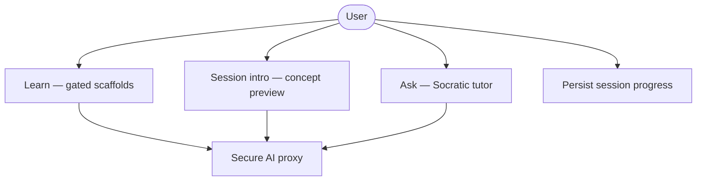
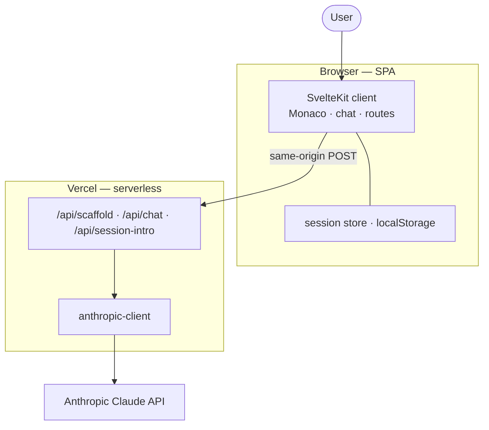
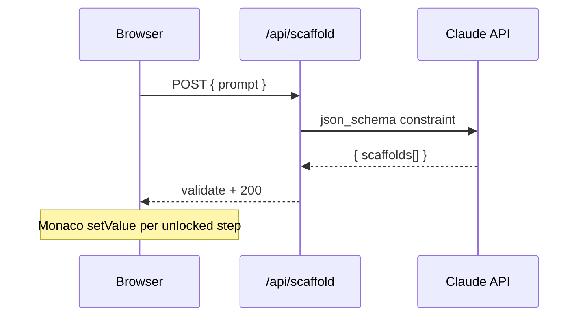
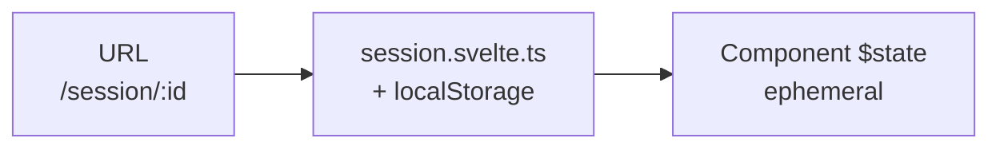

<!-- _class: lead -->

# Scaffy

**AI that teaches you to build good code, not just builds for you.**

Fachhochschule · Frontend-UI · SoSe 2026

---

## Agenda

1. Problem & Hypothese
2. Architektur (ABB / SSB) — [`docs/architecture.md`](../docs/architecture.md)
3. API, Monaco, Chat
4. State & Persistierung
5. Entscheidungen (ADRs) — [`docs/decisions.md`](../docs/decisions.md)
6. Pflicht-Checkliste — [`Projektsteckbrief_Scaffy.md`](../Projektsteckbrief_Scaffy.md)
7. **Live-Demo**

---

## Was tut Scaffy?

Der User gibt einen Prompt ein → Claude liefert **geordnete Scaffolds** (Code + Knowledge Check pro Schritt).

- Code erscheint im **Monaco Editor**
- **Learning Cards** blockieren den nächsten Chunk
- **Ask** erklärt nebenan — ersetzt die Lernfrage nicht

---

## Hypothese: Friction _während_ des Aufbaus

> Erklärung _nach_ dem fertigen Code wird übersprungen — wie die Bankkarte _nach_ dem Geld am Automaten.

**Scaffy:** erst Verständnisfrage, dann nächster Code-Chunk.

Details: [`Projektsteckbrief_Scaffy.md`](../Projektsteckbrief_Scaffy.md)

---

## User-Flow (Demo)

1. **Home** — Prompt + Beispiel-Chips → Session starten
2. **Parallel:** Session-Intro (SSE in Ask) + Scaffold (REST)
3. **Gate:** „Got it — start lesson“
4. **Session** — Monaco + Learning Card + Ask-Chat
5. **Sessions** — gespeicherte Lektionen

---

## Logische Architektur (ABB)

<!-- sync: docs/architecture.md §1 -->



---

## Physische Architektur (SSB)

<!-- sync: docs/architecture.md §2 -->



---

## Sicherheit: kein API-Key im Browser

[`ADR-003`](../docs/decisions.md#adr-003-claude-only-via-server-api-routes)

```
Browser  →  /api/*  (SvelteKit)  →  api.anthropic.com
```

- `ANTHROPIC_API_KEY` nur serverseitig (`$env/static/private`)
- Learn: **REST** + JSON-Schema · Ask & Intro: **SSE**

---

## Learn — Structured JSON

<!-- sync: docs/architecture.md §4 Learn -->



`src/routes/api/scaffold/+server.ts` · `src/lib/server/scaffold/`

---

## Monaco + Learning Card

[`ADR-011`](../docs/decisions.md#adr-011-monaco-typewriter-and-viewzones-planned)

- **`changeViewZones`** — Card scrollt mit dem Code
- Editor **read-only** bis Lektion fertig
- Copy auf Code erlaubt · Card-Inhalt nicht kopierbar (Friction)

`src/lib/components/editor/learning-card.svelte`

---

## State — drei Ebenen

<!-- sync: docs/architecture.md §6 -->



Ask-Verlauf: Navigation ✅ · Full Reload ❌ (bewusst, ADR-014)

---

## Tech-Stack (Kurz)

| Bereich   | Wahl                         |
| --------- | ---------------------------- |
| Framework | SvelteKit 5 · SPA            |
| UI        | shadcn-svelte · Tailwind 4   |
| Editor    | Monaco (viewZones)           |
| KI        | Claude · `@anthropic-ai/sdk` |
| Deploy    | Vercel · GitHub Actions      |

Vollständig: [`docs/architecture.md` §5](../docs/architecture.md#5-technologies-meta)

---

<!-- _class: compact -->

## Pflicht-Checkliste (Auszug)

Quelle: [`Projektsteckbrief_Scaffy.md`](../Projektsteckbrief_Scaffy.md)

| Status | Anforderung                                 |
| ------ | ------------------------------------------- |
| ✅     | ≥5 Komponenten, ≥2 mehrfach genutzt         |
| ✅     | Globaler State von ≥2 Routen                |
| ✅     | 3 Routen (`/`, `/session/:id`, `/sessions`) |
| ✅     | Externe API mit User-Input                  |
| ✅     | Formular mit ≥2 Validierungsregeln          |
| ✅     | Loading + Error States                      |
| ⚠️     | Reactivity ohne dedizierte ProgressBar      |
| ⚠️     | `currentIndex` nicht in localStorage        |

---

## Key ADRs

Vollständiger Log: [`docs/decisions.md`](../docs/decisions.md)

| ADR                                                                                                  | Thema                                   |
| ---------------------------------------------------------------------------------------------------- | --------------------------------------- |
| [002](../docs/decisions.md#adr-002-spa-sveltekit-5-no-ssr-for-app-shell)                             | SPA, kein SSR für App-Shell             |
| [004](../docs/decisions.md#adr-004-separate-api-endpoints-for-learn-and-ask)                         | Getrennte Endpoints Learn / Ask / Intro |
| [018](../docs/decisions.md#adr-018-scaffy-modal-product-dialogs)                                     | ScaffyModal statt Dialog-Chaos          |
| [020](../docs/decisions.md#adr-020-client-side-i18n-english--german-via-flat-translation-dictionary) | i18n EN/DE                              |
| [021](../docs/decisions.md#adr-021-session-intro-stream-and-lesson-start-gate)                       | Intro-Stream + Lesson-Start-Gate        |
| [022](../docs/decisions.md#adr-022-shadcn-vs-custom-ui-controls)                                     | shadcn vs. leichtes Custom-UI           |

---

## Live-Demo — Dateisprünge

| Was zeigen        | Pfad                                                    |
| ----------------- | ------------------------------------------------------- |
| Prompt + Chips    | `src/lib/components/home/start-learning-session.svelte` |
| Scaffold-Proxy    | `src/routes/api/scaffold/+server.ts`                    |
| Session-Workspace | `src/lib/components/session/session-workspace.svelte`   |
| Learning Card     | `src/lib/components/editor/learning-card.svelte`        |
| Ask SSE           | `src/lib/api/chat-stream.ts`                            |
| Session-Store     | `src/lib/session.svelte.ts`                             |

**Live:** [scaffy.vercel.app](https://scaffy.vercel.app/)

---

## Ausblick

- **A/B-Studie** (geplant): Scaffolding + Friction vs. klassisches Agentic Coding
- **Persistierung Phase 2:** Schritt-Index, ggf. Supabase ([ADR-014](../docs/decisions.md#adr-014-learning-session-persistence-port--localstorage-first))
- **Typewriter** pro Scaffold ([ADR-011](../docs/decisions.md#adr-011-monaco-typewriter-and-viewzones-planned))

---

<!-- _class: lead -->

# Fragen?

Slides: `present/scaffy-course.md`

Doku: `docs/` · Checkliste: `Projektsteckbrief_Scaffy.md`
